# Enhanced Mainframe Analyzer - Complete Documentation

## Overview

The Enhanced Mainframe Analyzer is a comprehensive tool designed to analyze mainframe systems, track file lifecycles, identify field usage patterns, and map program flows. It uses intelligent token management and progressive analysis to handle large mainframe codebases efficiently.

## Table of Contents

1. [Core Features](#core-features)
2. [File Lifecycle Analysis](#file-lifecycle-analysis)
3. [Field Usage Tracking](#field-usage-tracking)
4. [Program Flow Analysis](#program-flow-analysis)
5. [Unused Code Detection](#unused-code-detection)
6. [Real-World Example: Restricted Asset File (TMS79RAU)](#real-world-example)
7. [Technical Architecture](#technical-architecture)
8. [Usage Examples](#usage-examples)

---

## Core Features

### 🧠 Smart Token Management
- **Real-time token usage tracking** - Monitors how much processing capacity is being used
- **Intelligent content optimization** - Focuses on the most important code sections first  
- **Overlapping context windows** - Maintains understanding across different file sections
- **Automatic chunking strategies** - Breaks large files into manageable pieces intelligently

### ✅ Advanced Validation
- **Response quality assessment** - Scores analysis completeness from 1 to 10
- **Completeness scoring** - Tracks what percentage of the analysis is complete
- **Structured format validation** - Ensures results are presented consistently
- **Automatic retry mechanisms** - Tries again if something fails

### 🔄 Progressive Analysis
- **Multi-stage processing pipeline** - Breaks analysis into 4 manageable stages
- **Checkpoint-based recovery** - Can resume if interrupted
- **Context preservation** - Maintains relationships between different files
- **Incremental result assembly** - Builds comprehensive analysis step by step

### 💬 Interactive Chat
- **Context-aware responses** - Answers based on your actual analysis results
- **Deep component insights** - Provides detailed explanations about your code
- **Suggested questions** - Guides you to ask relevant questions
- **Real-time analysis queries** - Lets you explore your results dynamically

---

## File Lifecycle Analysis

### Purpose
Track how files are created, updated, referenced, and used throughout the mainframe system lifecycle.

### Key Capabilities

#### 1. **File Creation Tracking**
The system examines COBOL copybooks, JCL jobs, and COBOL programs to understand:
- How files are originally defined and created
- What VSAM parameters and access methods are used
- Complete timeline of when files were established
- What other files they depend on

#### 2. **Update Pattern Analysis**
The system tracks:
- Which programs modify file contents and how often
- What triggers updates to happen
- What conditions must be met before updates occur
- What data validation rules are applied during updates

#### 3. **Reference Mapping**
The system identifies:
- Which programs read from files and how often
- What lookup operations happen against the files
- How files reference each other
- The chain of dependencies between different files

#### 4. **Usage Classification**
Files are categorized as:
- **INPUT FILES**: Where source data enters the system
- **PROCESSING FILES**: Temporary working storage during processing
- **OUTPUT FILES**: Where final results are stored
- **REFERENCE FILES**: Used for lookups and validation
- **ARCHIVE FILES**: Historical data storage

### Example Analysis Output

**File Analysis Results for TMS79RAU (Restricted Asset File)**
- File Type: VSAM Key-Sequenced Dataset
- Primary Key: ASSET-ID (10 characters)
- Record Length: 150 characters
- Created by: RAU001 Asset Creation Program
- Updated by: RAU002 Asset Update Program and RAU005 Status Change Program
- Referenced by: ORD001, ORD002, ORD003 Order Processing Programs
- Current Status: Active in Production
- Business Importance: High - Critical for order processing workflow

---

## Field Usage Tracking

### Comprehensive Field Analysis

The analyzer tracks individual fields through their complete lifecycle from definition to final use.

#### 1. **Field Definition Analysis**
The system extracts from copybooks:
- Field names and their hierarchical level numbers in COBOL
- Picture clauses that define data types and lengths
- OCCURS clauses that create repeating groups or arrays
- REDEFINES relationships where fields share the same storage
- COMP usage clauses for storage optimization

#### 2. **Usage Pattern Classification**
Each field gets tagged with how it's used:
- 🟢 **DEFINED** - Field is declared in a copybook
- 🔵 **INPUT** - Field receives data from external sources
- 🟡 **CALCULATED** - Field value is computed from other fields
- 🟠 **ASSIGNED** - Field gets value via MOVE operations
- 🟣 **VALIDATED** - Field is checked against business rules
- 🔴 **UNUSED** - Field is defined but never referenced anywhere

#### 3. **Cross-Program Tracking**
The system tracks field usage across:
- COBOL programs that read the field for processing
- Programs that modify or update the field
- Validation routines that check the field against business rules
- Reports that display the field to users
- Interfaces that transmit the field to other systems

### Field Lifecycle States

Fields progress through these stages:
**Defined** → **Initialized** → **Validated** → **Processed** → **Updated** → **Referenced** → **Archived**

Some fields may become **Unused/Stale** and become **Cleanup Candidates**

### Real Example: TMS79RAU Fields

**Field Analysis: ASSET-ID (Primary Key)**
- Definition: Level 01 field, 10 characters long, alphanumeric
- How it's used: INPUT, VALIDATED, REFERENCED across multiple programs
- Programs that use it: RAU001 for creation, RAU002 for updates, ORD001 through ORD006 for lookups
- Lifecycle: Data Input → Validation → Processing → Reference by other programs
- Business Importance: High - This is the primary identifier for all assets
- Usage Statistics: Referenced 47 times across 6 different programs

**Field Analysis: RESTRICTED-STATUS**
- Definition: Level 01 field, 1 character, can only be 'Y' for Yes or 'N' for No
- How it's used: INPUT, CALCULATED, VALIDATED by business logic
- Programs that use it: RAU002 for updates, ORD001-ORD006 to check before allowing orders
- Lifecycle: Data Input → Business Logic → Validation → Decision Point for order processing
- Business Importance: Critical - Controls whether orders can be placed for this asset
- Usage Statistics: Referenced 23 times across 8 different programs

**Field Analysis: LAST-UPDATE-DATE**
- Definition: Level 01 field, 8 numeric digits for date (YYYYMMDD format)
- How it's used: CALCULATED (system-generated), ASSIGNED automatically
- Programs that use it: RAU002 generates it automatically, RPT001 uses it for reporting
- Lifecycle: System Generated → Stored in record → Used in Reports
- Business Importance: Medium - Provides audit trail of when records were changed
- Usage Statistics: Referenced 5 times across 3 programs

**Field Analysis: LEGACY-CODE (Example of unused field)**
- Definition: Level 01 field, 5 characters, alphanumeric
- How it's used: UNUSED - defined but never referenced anywhere
- Programs that use it: None - appears to be left over from older system version
- Lifecycle: Defined → Never Used → Candidate for Cleanup
- Business Importance: Low - Historical artifact that can likely be removed
- Usage Statistics: 0 references found in any program

---

## Program Flow Analysis

### Complete Program Execution Flow

#### 1. **Entry Point Analysis**
The system identifies how programs start running:
- JCL job step execution from batch jobs
- CICS transaction calls from online screens
- Program-to-program calls from other COBOL programs
- Online screen transactions initiated by users

#### 2. **Processing Flow Mapping**
The system maps the complete execution path:
- Initialization routines that set up the program
- Main processing loops that do the core work
- Decision points and business logic that control flow
- Error handling procedures for when things go wrong
- Cleanup and termination routines that finish the program

#### 3. **Call Chain Analysis**
The system tracks program relationships:
- **Calling programs** - What programs invoke this program
- **Called programs** - What programs this program invokes
- Parameter passing between programs and what data is shared
- Return code handling and how success/failure is communicated
- Conditional execution paths based on different scenarios

### Program Flow Example: Asset Management System

**Main Program Analysis: RAU001 (Asset Creation)**

**How the program starts:**
- Started by JCL Job called ASSETCRT for batch processing
- Started by CICS Transaction TMS1 for online processing
- Receives parameters: ASSET-ID, CUSIP, SEDOL identifiers

**Processing Flow Steps:**
1. Initialize working storage areas and variables
2. Validate that input parameters are in correct format
3. Check TMS79RAU file to make sure ASSET-ID doesn't already exist
4. Validate that CUSIP identifier follows proper format rules
5. Set RESTRICTED-STATUS field based on business rules
6. Write new record to TMS79RAU file
7. Log transaction details in audit file for compliance
8. Return success or error code to calling program

**Programs this program calls:**
- VAL001: Validates CUSIP identifier format
- VAL002: Validates SEDOL identifier format  
- AUD001: Handles audit logging
- ERR001: Handles error processing and messages

**File Dependencies:**
- Reads from: TMS79RAU (to check for duplicates)
- Writes to: TMS79RAU (creates new record)
- References: CUSIP-MASTER (for validation)
- Updates: AUDIT-LOG (for transaction tracking)

---

## Unused Code Detection

### Comprehensive Cleanup Analysis

#### 1. **Unused Field Detection**
The system identifies fields that are:
- Defined in copybooks but never referenced in any program
- Referenced only in obsolete programs that are no longer used
- Part of legacy data structures that are no longer needed
- Duplicated across multiple copybooks unnecessarily

#### 2. **Dead Code Identification**
The system finds program segments that are:
- Unreachable due to logic changes over time
- Part of commented-out functionality that was disabled
- Legacy error handling that's no longer relevant
- Duplicate routines that exist in multiple programs

#### 3. **Orphaned File Detection**
The system locates files that are:
- Defined in the system but never accessed by any program
- Only written to but never read (data goes nowhere)
- Part of discontinued business processes
- Backup or archive files that are no longer maintained

### Cleanup Recommendations

**High Priority Cleanup (Safe to Remove)**
- Fields that are defined but have zero references anywhere
- Programs that are not called by any active job or transaction
- Files that show no read or write activity for 12+ months

**Medium Priority Review (Needs Investigation)**  
- Fields that have only 1-2 references (may be obsolete)
- Programs that are called only by batch jobs that rarely run
- Files that are accessed only by reporting programs

**Low Priority Monitoring (Keep but Monitor)**
- Fields that are used only in error handling routines
- Programs that are called only in exceptional circumstances
- Files that are used for regulatory compliance or audit purposes

---

## Real-World Example: Restricted Asset File (TMS79RAU)

### File Structure and Purpose

The TMS79RAU file is a critical component in the asset management system. It controls which financial assets are restricted from trading due to compliance or risk management rules.

#### File Definition Structure
The file contains these fields:
- **ASSET-ID**: 10-character primary key that uniquely identifies each asset
- **CUSIP**: 9-character CUSIP identifier (Committee on Uniform Securities Identification Procedures)
- **SEDOL**: 7-character SEDOL identifier (Stock Exchange Daily Official List)
- **ISIN**: 12-character ISIN code (International Securities Identification Number)
- **RESTRICTED-STATUS**: 1-character flag ('Y' for restricted, 'N' for not restricted)
- **RESTRICTION-TYPE**: 3-character code indicating type of restriction
- **EFFECTIVE-DATE**: 8-digit date when restriction becomes active (YYYYMMDD)
- **EXPIRY-DATE**: 8-digit date when restriction expires (YYYYMMDD)
- **LAST-UPDATE-DATE**: 8-digit date when record was last changed (system-maintained)
- **LAST-UPDATE-USER**: 8-character user ID of person who made the last change

### Complete Lifecycle Flow

#### 1. **Creation Phase**
**Screen Used: TMS01 (Asset Restriction Entry)**
- **Program: RAU001**
- **Function:** Create new restricted asset records in the system
- **Validation:** Checks CUSIP/SEDOL format, ensures no duplicates exist
- **Business Rules:** Effective date must be today or later, expiry date must be after effective date

**Step-by-Step Process:**
1. User enters asset identifiers on the TMS01 screen
2. RAU001 program validates that input formats are correct
3. Program checks TMS79RAU file to see if restriction already exists
4. Program validates identifiers against master asset file
5. Program creates new restriction record with all details
6. System updates audit trail with transaction details

#### 2. **Update Phase**
**Screen Used: TMS02 (Asset Restriction Update)**
- **Program: RAU002**
- **Function:** Modify existing restriction details
- **Validation:** Confirms record exists, checks user has authorization
- **Business Rules:** Cannot modify restrictions that have already expired

**Step-by-Step Process:**
1. User searches by ASSET-ID or CUSIP on TMS02 screen
2. RAU002 program reads current record from TMS79RAU file
3. Screen displays current values for user to modify
4. Program validates changes against established business rules
5. Program updates record with new values
6. System automatically sets LAST-UPDATE-DATE and LAST-UPDATE-USER fields

#### 3. **Reference Phase (Order Processing)**
**Order Screen Integration:**
- **ORD001: Order Entry** - checks restriction status before accepting any order
- **ORD002: Order Modification** - re-validates restriction status when orders change
- **ORD003: Order Execution** - performs final restriction check before execution
- **ORD004: Order Reporting** - includes restriction status in all reports
- **ORD005: Order History** - tracks any restriction violations that occurred
- **ORD006: Order Analytics** - analyzes impact of restrictions on trading volume

**Reference Programs:**
- **REF001:** Provides real-time restriction lookup for online systems
- **REF002:** Handles batch restriction validation for large order files
- **REF003:** Generates restriction reports for compliance team

### Field Usage Analysis Results

**Analysis Summary for TMS79RAU File:**

**Highly Used Fields (10 or more references):**
- **ASSET-ID:** Used 47 times across 8 different programs - primary identifier
- **RESTRICTED-STATUS:** Used 23 times across 6 programs - core business logic field
- **CUSIP:** Used 19 times across 5 programs - important secondary identifier

**Moderately Used Fields (5-10 references):**
- **EFFECTIVE-DATE:** Used 8 times across 4 programs - important for date logic
- **EXPIRY-DATE:** Used 7 times across 3 programs - controls when restrictions end
- **SEDOL:** Used 6 times across 3 programs - alternative identifier

**Lightly Used Fields (1-4 references):**
- **RESTRICTION-TYPE:** Used 4 times across 2 programs - classification field
- **LAST-UPDATE-DATE:** Used 3 times across 2 programs - audit information
- **LAST-UPDATE-USER:** Used 2 times across 1 program - audit information

**Unused Fields (0 references - cleanup candidates):**
- **ISIN:** Defined in the file structure but never referenced in any program

### Program Dependencies

**Programs Using TMS79RAU File:**

**Primary Maintenance Programs:**
- **RAU001:** Creates new restrictions (writes new records to file)
- **RAU002:** Updates existing restrictions (reads and updates records)
- **RAU003:** Deletes expired restrictions (reads and deletes records)

**Reference Programs (Read-Only Access):**
- **ORD001-ORD006:** Order processing programs that check restrictions
- **REF001-REF003:** Reporting and lookup programs

**Batch Programs:**
- **BAT001:** Daily restriction report for compliance team
- **BAT002:** Automated cleanup of expired restrictions
- **BAT003:** Monthly restriction audit report for management

**Integration Points:**
- **Feeds data to:** Risk management system for portfolio analysis
- **Receives data from:** Compliance management system for new restrictions
- **Synchronizes with:** Master asset database for identifier validation

---

## Technical Architecture

### Token Management System

**Intelligent Token Optimization Process:**
The system estimates that roughly 4 characters equal 1 token on average. It uses only 80% of available tokens as a safety margin. The system prioritizes critical code sections like COPY statements, CALL statements, and EXEC statements. It implements overlapping context windows so that information isn't lost when processing large files in chunks.

**Chunking Strategy:**
Primary files that contain the searched component get highest priority. Secondary files are grouped by how relevant they are. The system maintains a 20-line overlap between chunks to preserve context. Large files are split at logical boundaries like procedure divisions or copybook sections rather than arbitrary points.

### Progressive Analysis Pipeline

**Stage 1: Component Identification (20% of total time)**
- Locates the target component across all uploaded files
- Determines what type of component it is (COPYBOOK, PROGRAM, FIELD, or JCL)
- Maps initial relationships and dependencies with other components
- Assigns confidence score based on how many matches are found

**Stage 2: Multi-Chunk Analysis (40% of total time)**
- Processes files in optimized chunks to stay within token limits
- Maintains context across chunk boundaries using overlap techniques
- Builds comprehensive usage patterns by analyzing all references
- Tracks relationships between programs and how they interact

**Stage 3: Detailed Enhancement Processing (30% of total time)**
- Performs specialized analysis based on the component type identified
- Takes deep dive into business logic and data flow patterns
- Identifies opportunities for optimization and improvement
- Assesses potential for modernization efforts

**Stage 4: Validation & Quality Assessment (10% of total time)**
- Validates that analysis is complete and makes sense
- Scores quality metrics on a 1-10 scale based on multiple factors
- Generates actionable recommendations for next steps
- Produces final consolidated report with all findings

### Quality Metrics

**Analysis Quality Score (1-10 scale):**
- Base score comes from component confidence level (how sure we are we found it)
- Depth bonus awarded for comprehensive analysis with many details
- Structure bonus given for well-formatted, organized output
- Business context bonus added for practical insights that help decision-making

**Completeness Score (percentage):**
- Component identified and located in files
- Usage patterns mapped across programs  
- Dependencies documented and understood
- Business impact assessed and explained
- Recommendations provided for next steps

**Confidence Score (1-10 scale):**
- Based on number of matches found across files
- File type relevance to the search (copybooks score higher for field searches)
- Quality of context around matches (clear usage vs. just mentions)
- Cross-validation across multiple files (consistency check)

---

## Usage Examples

### Example 1: Analyzing a Copybook

**What you enter:** Component name "CUSTOMER-RECORD"
**Files uploaded:** CUSTCOPY.cpy, CUST001.cbl, CUST002.cbl, CUSTRPT.cbl

**Analysis Results:**
- **Component Type:** COPYBOOK (data structure definition)
- **Found In:** CUSTCOPY.cpy at line 15, CUST001.cbl at line 23, CUST002.cbl at line 31
- **Field Count:** 23 individual fields identified within the copybook
- **Usage Programs:** CUST001 handles create/read/update/delete operations, CUST002 performs validation, CUSTRPT generates reports
- **Unused Fields:** 3 legacy fields identified that can be cleaned up
- **Quality Score:** 9 out of 10 (high confidence, comprehensive analysis)
- **Business Impact:** High importance because this is customer master data

### Example 2: Tracking Field Lifecycle

**What you enter:** Field name "CUSTOMER-STATUS"
**Analysis Results:**

**Field Definition:** Level 05 field, 2 characters, can contain 'AC' (Active), 'IN' (Inactive), 'SU' (Suspended), or 'CL' (Closed)

**Lifecycle Stages the field goes through:**
1. **Creation:** User enters value via CICS screen CUST01
2. **Validation:** Business rules program CUSTVAL checks if value is valid
3. **Processing:** Status change program CUSTUPD modifies value based on business events
4. **Reference:** Order processing programs ORD001-ORD005 check status before allowing transactions
5. **Reporting:** Status summary program CUSTRPT includes field in management reports
6. **Archive:** Historical tracking program CUSTARCH preserves old values for audit

**Usage Statistics:**
- **Total References:** 34 times across 8 different programs
- **Input Operations:** 3 programs allow users to enter or change this field
- **Update Operations:** 2 programs can modify the field automatically
- **Reference Operations:** 6 programs read the field to make business decisions
- **Validation Rules:** 5 different business rules check this field
- **Business Impact:** Critical - controls all customer interactions and transactions

### Example 3: Program Flow Analysis

**What you enter:** Program name "CUST001"
**Flow Analysis Results:**

**How the program can be started:**
- **JCL Job:** CUSTMNT job for batch processing of customer changes
- **CICS Transaction:** CST1 transaction for online customer maintenance

**Step-by-step processing flow:**
1. Initialize working storage areas and set up variables
2. Read customer input parameters from calling program or screen
3. Validate customer data by calling CUSTVAL validation program
4. Check for existing customer by reading CUSTOMER-MASTER file
5. Apply business rules by calling CUSTRULE business logic program
6. Update customer record by writing to CUSTOMER-MASTER file
7. Log transaction by calling CUSTAUDT audit program
8. Return completion status to calling program or screen

**Program Dependencies:**
- **Reads from:** CUSTOMER-MASTER file, PRODUCT-MASTER file for validation
- **Writes to:** CUSTOMER-MASTER file with updates, AUDIT-LOG file for tracking
- **Calls:** CUSTVAL for validation, CUSTRULE for business logic, CUSTAUDT for audit
- **Called by:** CUSTBATCH batch program, CICS transaction CST1 for online

**Performance Information:**
- **Average execution time:** 0.23 seconds per transaction
- **Database operations:** 3 read operations, 1 write operation per execution
- **Error rate:** 0.02% - highly reliable program with good error handling

---

## Benefits and Value Proposition

### For System Analysis
- **Complete Visibility:** See the entire component lifecycle across all programs in your system
- **Impact Assessment:** Understand what will be affected before making any changes
- **Dependency Mapping:** Visualize how different components relate to each other
- **Quality Insights:** Identify areas that need attention or cleanup

### For Modernization Projects
- **Legacy Assessment:** Identify unused code that can be safely removed
- **Complexity Analysis:** Understand how interdependent your systems are
- **Migration Planning:** Map out which components should be modernized first
- **Risk Mitigation:** Avoid breaking critical business processes during changes

### For Maintenance Teams
- **Documentation Generation:** Create comprehensive system documentation automatically
- **Change Impact Analysis:** Assess how modifications will ripple through the system
- **Code Quality Improvement:** Identify cleanup opportunities and technical debt
- **Knowledge Transfer:** Help new team members understand how legacy systems work

---

## Complete System Flow Diagrams

### Overall System Architecture Flow


### Detailed Analysis Pipeline Flow


## Feature-Specific Flow Diagrams

### 1. Smart Token Management Flow


**Example: TMS79RAU Analysis Token Management**


### 2. Progressive Analysis Flow


**Example: CUSTOMER-RECORD Copybook Analysis**


### 3. Advanced Validation Flow

```mermaid
graph TD
    A[LLM Response Received] --> B[validateResponse]
    B --> C{Response Length > 50?}
    C -->|No| D[Mark as Invalid<br/>Too Short]
    C -->|Yes| E{Contains Required Fields?}
    E -->|No| F[Mark as Invalid<br/>Missing Fields]
    E -->|Yes| G[calculateQualityScore]
    G --> H[Base Score from Confidence<br/>0-30 points]
    H --> I[Analysis Depth Score<br/>0-30 points]
    I --> J[Structure Score<br/>0-20 points]
    J --> K[Business Context Score<br/>0-20 points]
    K --> L[Total Quality Score<br/>0-100 → 1-10 scale]
    L --> M[assessCompleteness]
    M --> N[Check Component Found<br/>✓/✗]
    N --> O[Check Location Mapped<br/>✓/✗]
    O --> P[Check Usage Context<br/>✓/✗]
    P --> Q[Check Related Components<br/>✓/✗]
    Q --> R[Check Detailed Analysis<br/>✓/✗]
    R --> S[Check Business Impact<br/>✓/✗]
    S --> T[Completeness Percentage<br/>Completed/Total * 100]
    T --> U{Quality < 7?}
    U -->|Yes| V[callvLLMAPIWithRetry<br/>Attempt 2/3]
    U -->|No| W[Accept Results]
    V --> A
    
    D --> X[Retry or Fail]
    F --> X
    
    style G fill:#2196F3,color:#fff
    style M fill:#2196F3,color:#fff
    style V fill:#FF9800,color:#000
```



**Example: TMS79RAU Quality Assessment**

```mermaid
graph LR
    A[LLM Response<br/>1847 characters] --> B[Quality Scoring]
    B --> C[Confidence: 9/10<br/>→ 27 points]
    C --> D[Analysis Depth<br/>→ 28 points]
    D --> E[Good Structure<br/>→ 20 points]
    E --> F[Business Context<br/>→ 18 points]
    F --> G[Total: 93/100<br/>Quality Score: 9/10]
    G --> H[Completeness Check]
    H --> I[Component Found: ✓<br/>Location Mapped: ✓<br/>Usage Context: ✓<br/>Related Components: ✓<br/>Detailed Analysis: ✓<br/>Business Impact: ✓]
    I --> J[Completeness: 100%<br/>6/6 criteria met]
    
    style G fill:#4CAF50,color:#fff
    style J fill:#4CAF50,color:#fff
```


### 4. Interactive Chat Flow

```mermaid
graph TD
    A[User Types Question] --> B[sendChatMessage]
    B --> C{Component Analyzed?}
    C -->|No| D[Show Error<br/>'Analyze component first']
    C -->|Yes| E[addChatMessage<br/>User message]
    E --> F[showChatTyping<br/>Display typing indicator]
    F --> G[processEnhancedChatQuery]
    G --> H[Build Enhanced Prompt<br/>Context + Question]
    H --> I[Include Analysis Results<br/>componentAnalysis[component]]
    I --> J[Include Quality Metrics<br/>Score, Completeness, Confidence]
    J --> K[Include File Context<br/>uploadedFiles info]
    K --> L[LLM API Call<br/>Chat Query]
    L --> M[Format Response<br/>Markdown, code highlighting]
    M --> N[hideChatTyping]
    N --> O[addChatMessage<br/>Assistant response]
    O --> P[Update Chat History<br/>Store for context]
    
    style L fill:#9C27B0,color:#fff
```

**Example: Chat Query Flow for RESTRICTED-STATUS Field**


### 5. File Lifecycle Analysis Flow


**Example: TMS79RAU File Lifecycle**


### 6. Field Usage Tracking Flow


**Example: RESTRICTED-STATUS Field Tracking**
```mermaid
graph TD
    A[RESTRICTED-STATUS Field] --> B[Found in TMS79RAU.cpy<br/>Definition: PIC X(1)]
    B --> C[Found in RAU002.cbl<br/>Line 145: IF RESTRICTED-STATUS = 'Y']
    C --> D[Found in ORD001.cbl<br/>Line 67: READ TMS79RAU]
    D --> E[Found in ORD002.cbl<br/>Line 89: MOVE 'Y' TO RESTRICTED-STATUS]
    E --> F[Usage Classification]
    F --> G[INPUT: RAU002 screen entry]
    G --> H[VALIDATED: Business rule checks]
    H --> I[ASSIGNED: Status calculations]  
    I --> J[REFERENCED: Order processing]
    J --> K[Usage Summary<br/>23 references across 8 programs]
    K --> L[Lifecycle: Input → Validation → Processing → Order Control]
    L --> M[Business Impact: CRITICAL<br/>Controls all order processing]
    
    style G fill:#4CAF50,color:#fff
    style H fill:#9C27B0,color:#fff
    style I fill:#FF9800,color:#000
    style J fill:#2196F3,color:#fff
    style M fill:#f44336,color:#fff
```

### 7. Unused Code Detection Flow


**Example: TMS79RAU Unused Field Detection**


## How the Analysis Process Works

### Step-by-Step Process Flow

**When you click "Analyze Component":**
1. **Check Requirements:** System validates that files are uploaded, component name is entered, and API connection is working
2. **Start Progressive Analysis:** System begins the 4-stage analysis pipeline and shows progress
3. **Run Component Analysis:** System goes through each stage systematically

**Stage 1: Component Identification**
1. **Filter Relevant Files:** System finds files that contain the component name or related patterns
2. **Optimize Content:** System intelligently reduces file content to fit within processing limits while keeping important parts
3. **Call AI Analysis:** System sends optimized content to AI for component identification and classification
4. **Parse Results:** System interprets the AI response to understand component type, location, and confidence level

**Stage 2: Multi-Chunk Analysis**
1. **Create Smart Chunks:** System breaks files into overlapping pieces that maintain context
2. **Process Each Chunk:** System sends each chunk to AI for detailed analysis (typically 2-5 chunks)
3. **Build Progressive Context:** Each chunk analysis builds on previous findings
4. **Merge Results:** System combines all chunk analyses while avoiding duplication

**Stage 3: Specialized Analysis**
1. **Determine Component Type:** System performs specialized analysis based on whether it's a copybook, program, field, or JCL
2. **Deep Dive Analysis:** System performs component-specific deep analysis (copybook lifecycle, program flow, etc.)
3. **Business Context:** System analyzes business impact and modernization opportunities

**Stage 4: Validation and Assembly**
1. **Validate Results:** System checks analysis quality and completeness
2. **Calculate Scores:** System assigns quality scores (1-10) and completeness percentages
3. **Generate Recommendations:** System creates actionable suggestions based on findings
4. **Store and Display:** System saves results and shows them in multiple specialized tabs

**Interactive Chat Activation:**
1. **Enable Chat:** System activates chat functionality with full context from analysis
2. **Context Preservation:** Chat has access to all analysis results for detailed questions
3. **Real-time Responses:** Users can ask questions and get detailed answers based on their specific analysis

---

## Conclusion

The Enhanced Mainframe Analyzer provides unprecedented insight into mainframe system lifecycles, enabling organizations to:

1. **Understand** complex legacy systems through comprehensive analysis
2. **Optimize** system performance by identifying unused components  
3. **Modernize** efficiently by mapping dependencies and relationships
4. **Maintain** systems confidently with complete impact visibility
5. **Document** systems automatically for knowledge preservation

The tool's intelligent token management and progressive analysis approach makes it capable of handling large, complex mainframe environments while providing actionable insights for system improvement and modernization efforts. Rather than requiring technical expertise to interpret results, the system presents findings in business terms that help teams make informed decisions about their mainframe systems.