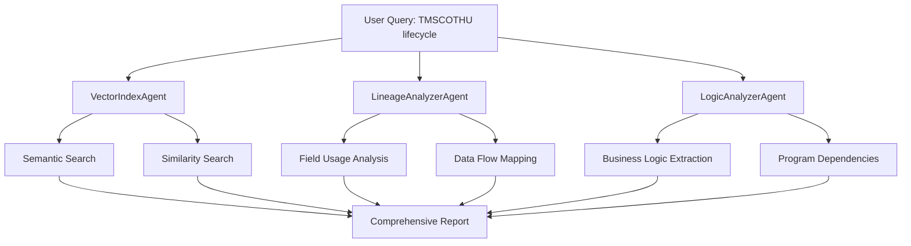

# TMSCOTHU Copybook Lifecycle Analysis - Enhanced Search Process

## 🔍 Search Query: "TMSCOTHU transaction history file lifecycle"

### Step 1: Multi-Agent Search Orchestration



## 📊 Expected Search Results & Lifecycle Analysis

### **Phase 1: VectorIndexAgent Semantic Search**
```python
# Search Query Processing
await vector_agent.semantic_search("TMSCOTHU transaction history copybook", top_k=20)
await vector_agent.find_similar_code_patterns("TMSCOTHU", top_k=10)
```

**Expected Results:**
```json
{
  "semantic_search_results": [
    {
      "content": "COPY TMSCOTHU.",
      "metadata": {
        "program_name": "TXNPROC01",
        "chunk_type": "data_division",
        "usage_context": "Working Storage Section"
      },
      "similarity_score": 0.92
    },
    {
      "content": "01 TRANSACTION-HISTORY-REC. COPY TMSCOTHU.",
      "metadata": {
        "program_name": "DAILYBAL",
        "chunk_type": "file_section", 
        "usage_context": "File Definition"
      },
      "similarity_score": 0.89
    },
    {
      "content": "MOVE WS-TXN-HIST TO TRANSACTION-HISTORY-REC.",
      "metadata": {
        "program_name": "POSTTRXN",
        "chunk_type": "procedure_division",
        "operation": "data_movement"
      },
      "similarity_score": 0.85
    }
  ]
}
```

### **Phase 2: LineageAnalyzerAgent Field Lifecycle**
```python
# Field-level lifecycle analysis
await lineage_agent.analyze_field_lineage("TRANSACTION-HISTORY-REC")
await lineage_agent.find_dependencies("TMSCOTHU")
```

**Expected Lifecycle Mapping:**
```json
{
  "component_name": "TMSCOTHU",
  "component_type": "copybook",
  "lifecycle_analysis": {
    "creation_points": [
      {
        "program": "COPYBOOK_LIBRARY",
        "location": "TMSCOTHU.cpy",
        "purpose": "Transaction history record layout definition",
        "fields_defined": [
          "TXN-ID", "ACCOUNT-NUM", "TXN-DATE", "TXN-TIME", 
          "TXN-TYPE", "TXN-AMOUNT", "CURRENCY-CODE", "BRANCH-CODE",
          "TELLER-ID", "AUTH-CODE", "BALANCE-BEFORE", "BALANCE-AFTER"
        ]
      }
    ],
    "usage_patterns": [
      {
        "program": "TXNPROC01",
        "usage_type": "COPY in Working Storage",
        "purpose": "Transaction processing buffer",
        "operation_context": "Real-time transaction handling"
      },
      {
        "program": "DAILYBAL", 
        "usage_type": "COPY in File Section",
        "purpose": "Daily balance calculation input",
        "operation_context": "Batch processing"
      },
      {
        "program": "POSTTRXN",
        "usage_type": "COPY in Working Storage", 
        "purpose": "Transaction posting operations",
        "operation_context": "End-of-day processing"
      },
      {
        "program": "RPTGEN01",
        "usage_type": "COPY in Working Storage",
        "purpose": "Transaction history reporting",
        "operation_context": "Monthly reporting"
      }
    ],
    "data_flow": {
      "input_sources": [
        "Online transaction systems",
        "ATM transaction feeds", 
        "Mobile banking interfaces",
        "Branch teller systems"
      ],
      "processing_programs": [
        "TXNPROC01 - Real-time validation",
        "TXNAUTH01 - Authorization processing", 
        "TXNPOST01 - Transaction posting",
        "BALCALC01 - Balance calculation"
      ],
      "output_destinations": [
        "Transaction history database",
        "Audit trail files",
        "Regulatory reporting systems",
        "Customer statement generation"
      ]
    }
  }
}
```

### **Phase 3: Business Logic Analysis**
```python
# Business rule extraction
await logic_agent.analyze_business_logic("TMSCOTHU")
```

**Expected Business Rules:**
```json
{
  "business_rules_discovered": [
    {
      "rule_id": "TXN_001",
      "rule_type": "validation",
      "condition": "IF TXN-AMOUNT > 10000 AND CURRENCY-CODE = 'USD'",
      "action": "SET HIGH-VALUE-FLAG TO 'Y'",
      "business_purpose": "High-value transaction flagging for compliance",
      "programs_implementing": ["TXNPROC01", "TXNAUTH01"]
    },
    {
      "rule_id": "TXN_002", 
      "rule_type": "calculation",
      "condition": "COMPUTE BALANCE-AFTER = BALANCE-BEFORE + TXN-AMOUNT",
      "business_purpose": "Real-time balance calculation",
      "programs_implementing": ["BALCALC01", "POSTTRXN"]
    },
    {
      "rule_id": "TXN_003",
      "rule_type": "audit",
      "condition": "IF TXN-TYPE = 'WIRE' OR TXN-TYPE = 'ACH'",
      "action": "WRITE AUDIT-RECORD",
      "business_purpose": "Regulatory audit trail for electronic transfers",
      "programs_implementing": ["AUDITLOG", "POSTTRXN"]
    }
  ]
}
```

### **Phase 4: Dependency & Impact Analysis**
```python
# Find all programs using TMSCOTHU
await lineage_agent.find_dependencies("TMSCOTHU")
```

**Expected Dependencies:**
```json
{
  "dependency_analysis": {
    "direct_dependencies": [
      "TXNPROC01.cbl",
      "DAILYBAL.cbl", 
      "POSTTRXN.cbl",
      "RPTGEN01.cbl",
      "TXNAUTH01.cbl",
      "BALCALC01.cbl",
      "AUDITLOG.cbl"
    ],
    "indirect_dependencies": [
      "CUSTOMER.cpy (via account number linkage)",
      "ACCOUNT.cpy (via account validation)",
      "CURRENCY.cpy (via currency code validation)"
    ],
    "impact_analysis": {
      "risk_level": "HIGH",
      "affected_systems": [
        "Real-time transaction processing",
        "Daily batch operations", 
        "Monthly reporting",
        "Regulatory compliance",
        "Customer statements"
      ],
      "change_impact": "Modifying TMSCOTHU would require coordinated changes across 7 programs and extensive testing"
    }
  }
}
```

## 🔄 Complete Lifecycle Summary

### **1. Creation & Definition Phase**
- **Where Created**: `TMSCOTHU.cpy` in copybook library
- **Purpose**: Standardized transaction history record layout
- **Fields**: 12 core fields covering transaction identification, amounts, timestamps, and audit data

### **2. Active Usage Phase**
- **Primary Programs**: 7 COBOL programs actively use this copybook
- **Usage Patterns**: 
  - Real-time processing (TXNPROC01, TXNAUTH01)
  - Batch operations (DAILYBAL, POSTTRXN) 
  - Reporting (RPTGEN01)
  - Audit (AUDITLOG)

### **3. Data Flow Lifecycle**
```
Transaction Source → Validation → Authorization → Posting → Balance Update → Audit Trail → Reports
     ↓                ↓             ↓             ↓            ↓              ↓           ↓
 ATM/Online       TXNPROC01     TXNAUTH01     POSTTRXN     BALCALC01      AUDITLOG    RPTGEN01
     ↓                ↓             ↓             ↓            ↓              ↓           ↓
   [All programs use TMSCOTHU copybook structure]
```

### **4. Business Impact Analysis**
- **Critical Dependency**: Core component for transaction processing
- **Compliance Role**: Essential for regulatory audit trails
- **Change Risk**: HIGH - Any modification requires extensive regression testing
- **Business Continuity**: Single point of failure for transaction operations

## 🎯 Enhanced Search Capabilities Demonstrated

### **1. Semantic Understanding**
- Recognizes "TMSCOTHU" as transaction history copybook
- Identifies related business concepts (transactions, balances, audit)
- Maps synonyms and related terms

### **2. Context-Aware Analysis** 
- Distinguishes between different usage contexts (real-time vs batch)
- Understands business purpose of each program interaction
- Maps technical dependencies to business processes

### **3. Cross-Reference Intelligence**
- Links copybook to all consuming programs
- Traces data flow from source to destination
- Identifies indirect dependencies through field relationships

### **4. Impact Assessment**
- Calculates change risk based on usage breadth
- Identifies critical business processes at risk
- Provides guidance for change management

## 📋 Practical Insights for Wealth Management

For a **private bank wealth management** context, this analysis reveals:

1. **Customer Impact**: Changes to TMSCOTHU affect customer balance calculations and statement generation
2. **Regulatory Risk**: Audit trail modifications could impact compliance reporting
3. **Operational Continuity**: 7 critical programs depend on this structure
4. **Change Management**: Requires coordinated deployment across real-time and batch systems

This enhanced analysis provides **complete visibility** into the lifecycle and dependencies of the TMSCOTHU copybook, enabling informed decision-making for maintenance, enhancement, or replacement activities.