# Opulence Mainframe Deep Research Agent Architecture

## 1. Simple System Overview (Plain English)

The Opulence system takes legacy mainframe code from a **private wealth bank's security transaction processing system** and makes it understandable using modern AI technology:

- **Input**: COBOL programs, JCL job scripts, PROC procedures, DB2 database definitions, and sample transaction data files from the bank's security trading platform
- **Processing**: Parses and loads them into structured format using a code parser and data loader
- **AI Analysis**: Uses a GPU-hosted CodeLLaMA model (exposed via HTTP API) to analyze and summarize complex business logic
- **Orchestration**: A Coordinator Agent manages the workflow across various specialized research agents
- **Output**: Provides lineage maps showing how customer data flows, business logic summaries explaining trading rules, comprehensive documentation, and an interactive chat interface for asking questions

**Example Scenario**: Understanding how a customer's security purchase order flows through 50+ COBOL programs, what validation rules apply, and how it updates the portfolio database.

---

## 2. Core Components (80/20 Rule Table)

| Component               | Function                                     | 80/20 Value                                                 |
|-------------------------|----------------------------------------------|-------------------------------------------------------------|
| **Code Parser**         | Converts COBOL/JCL into structured AST        | Enables structured understanding of 40-year-old trading logic |
| **Data Loader**         | Loads DB2 tables and sample transaction files | Adds real-world context from actual customer trades         |
| **Vector Index Agent**  | Embeds and indexes all elements in FAISS     | Powers fast semantic search: "find all margin calculation logic" |
| **Lineage Agent**       | Tracks fields across jobs and programs        | Critical for compliance: trace customer ID through entire system |
| **Logic Analyzer Agent**| Extracts business logic and conditional rules | Automates discovery of trading rules and validation logic   |
| **Documentation Agent** | Summarizes components and logic               | Generates readable docs explaining arcane settlement processes |
| **Chat Agent**          | Interfaces with user to answer questions      | "How does stop-loss order processing work?" gets instant answers |
| **Coordinator Agent**   | Orchestrates flow and agent sequencing        | Ensures systematic analysis of interconnected trading systems |
| **GPU LLM API**         | CodeLLaMA exposed via API for summarization  | Core intelligence for understanding legacy financial code    |

---

## 3. System Flow and Individual Agent Workflows

### Overall System Architecture Flow


---

## 4. Individual Agent Workflows

### 4.1 Code Parser Agent Flow

```mermaid
flowchart LR
    subgraph "Inputs (Top Left)"
        A1[SECTRD01.cbl<br/>Security Trading Program]
        A2[PORTFOLIO.jcl<br/>Portfolio Update Job]
        A3[CUSTMAST.proc<br/>Customer Master Procedure]
        A4[SETTLEMENT.cbl<br/>Settlement Processing]
    end
    
    subgraph "Processing Workflow (Center - Horizontal)"
        B1[📄 File Type Detection<br/>• COBOL vs JCL vs PROC<br/>• Business rule validation<br/>• Structure verification] --> B2[🔍 Content Parsing<br/>• Extract divisions/sections<br/>• Parse data definitions<br/>• Identify paragraphs<br/>• Extract PERFORM calls] --> B3[🧠 API-Based Analysis<br/>• Send code to CodeLLaMA<br/>• Extract business logic<br/>• Identify patterns<br/>• Generate descriptions] --> B4[📊 Chunk Creation<br/>• Create structured chunks<br/>• Add business context<br/>• Generate metadata<br/>• Calculate complexity] --> B5[💾 Database Storage<br/>• Store in SQLite<br/>• Create relationships<br/>• Index for search<br/>• Validate integrity]
    end
    
    subgraph "Outputs (Bottom Right)"
        C1[📋 Structured Chunks<br/>• 2,500 code segments<br/>• Business context metadata<br/>• Complexity scores]
        
        C2[🗄️ Database Records<br/>• program_chunks table<br/>• Field lineage data<br/>• Control flow paths]
        
        C3[📈 Analysis Metrics<br/>• Complexity: 6.2/10<br/>• Business rules: 15<br/>• Performance issues: 3]
    end
    
    A1 --> B1
    A2 --> B1
    A3 --> B1
    A4 --> B1
    
    B5 --> C1
    B5 --> C2
    B5 --> C3
    
    style A1 fill:#e1f5fe
    style A2 fill:#e1f5fe
    style A3 fill:#e1f5fe
    style A4 fill:#e1f5fe
    style C1 fill:#e8f5e8
    style C2 fill:#e8f5e8
    style C3 fill:#e8f5e8
```



### 4.2 Data Loader Agent Flow

```mermaid
flowchart LR
    subgraph "Inputs (Top Left)"
        D1[SECURITY_TXN.ddl<br/>Transaction Table Definition]
        D2[customer_data.csv<br/>Customer Master Data]
        D3[CUSTOMER_RECORD.cpy<br/>COBOL Copybook]
        D4[trades_sample.csv<br/>10000 Transaction Records]
    end
    
    subgraph "Processing Workflow (Center - Horizontal)"
        E1[🔍 File Analysis<br/>• Detect CSV vs DDL vs Copybook<br/>• Analyze structure patterns<br/>• Validate data formats<br/>• Estimate complexity] --> E2[📋 Schema Generation<br/>• Infer column types<br/>• Map COBOL PIC to SQL<br/>• Extract field relationships<br/>• Create constraints] --> E3[🧠 API Enhancement<br/>• Generate field descriptions<br/>• Classify data types<br/>• Identify business meaning<br/>• Add quality metrics] --> E4[🏗️ Table Creation<br/>• Create SQLite tables<br/>• Load sample data<br/>• Establish indexes<br/>• Validate integrity] --> E5[📊 Quality Analysis<br/>• Calculate completeness<br/>• Check data consistency<br/>• Identify anomalies<br/>• Generate metrics]
    end
    
    subgraph "Outputs (Bottom Right)"
        F1[🗃️ Data Tables<br/>• SECURITY_TXN 50 fields<br/>• CUSTOMER_DATA 25 fields<br/>• Sample data loaded]
        
        F2[📖 Data Catalog<br/>• Field descriptions<br/>• Business classifications<br/>• Quality scores 0.85/1.0]
        
        F3[🔗 Lineage Metadata<br/>• Source file mappings<br/>• Field relationships<br/>• Dependencies tracked]
    end
    
    D1 --> E1
    D2 --> E1
    D3 --> E1
    D4 --> E1
    
    E5 --> F1
    E5 --> F2
    E5 --> F3
    
    style D1 fill:#fff3e0
    style D2 fill:#fff3e0
    style D3 fill:#fff3e0
    style D4 fill:#fff3e0
    style F1 fill:#f3e5f5
    style F2 fill:#f3e5f5
    style F3 fill:#f3e5f5
```



### 4.3 Vector Index Agent Flow

```mermaid
flowchart LR
    subgraph "Inputs (Top Left)"
        G1[Parsed Code Chunks<br/>• 2,500 COBOL segments<br/>• Business context metadata<br/>• Field definitions]
        G2[Local CodeBERT Model<br/>• microsoft/codebert-base<br/>• CPU-based processing<br/>• Airgap compatible]
    end
    
    subgraph "Processing Workflow (Center - Horizontal)"
        H1[🔧 Model Initialization<br/>• Load CodeBERT on CPU<br/>• Initialize tokenizer<br/>• Setup embedding function<br/>• Avoid GPU conflicts] --> H2[⚡ Embedding Generation<br/>• Process chunks in batches<br/>• Generate 768-dim vectors<br/>• Normalize for similarity<br/>• Add business context] --> H3[🗂️ Index Creation<br/>• Build FAISS index<br/>• Store in ChromaDB<br/>• Create relationships<br/>• Optimize for search] --> H4[🔍 Search Capabilities<br/>• Semantic similarity<br/>• Business logic patterns<br/>• Code functionality<br/>• Cross-component analysis] --> H5[💾 Persistence<br/>• Save FAISS index<br/>• Store embeddings<br/>• Maintain metadata<br/>• Enable incremental updates]
    end
    
    subgraph "Outputs (Bottom Right)"
        I1[🎯 FAISS Index<br/>• 2,500 vectors stored<br/>• Sub-second search<br/>• Cosine similarity]
        
        I2[🔍 Search Results<br/>• Semantic code search<br/>• Similarity scores<br/>• Related components]
        
        I3[🌐 Knowledge Graph<br/>• Component relationships<br/>• Code pattern clusters<br/>• Dependency mappings]
    end
    
    G1 --> H1
    G2 --> H1
    
    H5 --> I1
    H5 --> I2
    H5 --> I3
    
    style G1 fill:#e8eaf6
    style G2 fill:#e8eaf6
    style I1 fill:#fff8e1
    style I2 fill:#fff8e1
    style I3 fill:#fff8e1
```



### 4.4 Lineage Analyzer Agent Flow

```mermaid
flowchart LR
    subgraph "Inputs (Top Left)"
        J1[Field References<br/>• CUSTOMER-ID usage<br/>• TRADE-AMOUNT flows<br/>• ACCOUNT-BALANCE updates]
        J2[Program Relationships<br/>• CALL statements<br/>• PERFORM references<br/>• File operations]
    end
    
    subgraph "Processing Workflow (Center - Horizontal)"
        K1[🔍 Reference Discovery<br/>• Search code patterns<br/>• Extract field usage<br/>• Map data flows<br/>• Identify transformations] --> K2[🧠 API Analysis<br/>• Analyze usage context<br/>• Extract business logic<br/>• Determine data flow<br/>• Classify operations] --> K3[📊 Impact Assessment<br/>• Calculate complexity<br/>• Assess risk levels<br/>• Identify dependencies<br/>• Generate recommendations] --> K4[🗺️ Lineage Mapping<br/>• Create flow diagrams<br/>• Build dependency graph<br/>• Track lifecycle stages<br/>• Document relationships] --> K5[📋 Report Generation<br/>• Compile findings<br/>• Generate summaries<br/>• Create recommendations<br/>• Export lineage data]
    end
    
    subgraph "Outputs (Bottom Right)"
        L1[🗺️ Lineage Maps<br/>• CUSTOMER-ID: 15 programs<br/>• 45 total references<br/>• Complete data flow]
        
        L2[⚠️ Impact Analysis<br/>• Risk Level: MEDIUM<br/>• 8 affected programs<br/>• Change recommendations]
        
        L3[📊 Lifecycle Reports<br/>• Creation → Usage → Archive<br/>• Business context<br/>• Compliance tracking]
    end
    
    J1 --> K1
    J2 --> K1
    
    K5 --> L1
    K5 --> L2
    K5 --> L3
    
    style J1 fill:#e0f2f1
    style J2 fill:#e0f2f1
    style L1 fill:#fce4ec
    style L2 fill:#fce4ec
    style L3 fill:#fce4ec
```



### 4.5 Logic Analyzer Agent Flow

```mermaid
flowchart LR
    subgraph "Inputs (Top Left)"
        M1[COBOL Programs<br/>• Business logic chunks<br/>• Conditional statements<br/>• Calculation rules]
        M2[JCL Job Flows<br/>• Step dependencies<br/>• Control statements<br/>• Error handling]
    end
    
    subgraph "Processing Workflow (Center - Horizontal)"
        N1[🔍 Pattern Detection<br/>• Identify IF-THEN logic<br/>• Extract calculations<br/>• Find validation rules<br/>• Map control flow] --> N2[🧮 Complexity Analysis<br/>• Calculate cyclomatic complexity<br/>• Assess nesting levels<br/>• Count decision points<br/>• Evaluate maintainability] --> N3[🧠 API Logic Extraction<br/>• Extract business rules<br/>• Identify optimization opportunities<br/>• Generate explanations<br/>• Document processes] --> N4[📊 Quality Assessment<br/>• Code quality metrics<br/>• Performance analysis<br/>• Risk identification<br/>• Best practice evaluation] --> N5[📋 Recommendation Engine<br/>• Generate improvements<br/>• Suggest refactoring<br/>• Identify technical debt<br/>• Prioritize changes]
    end
    
    subgraph "Outputs (Bottom Right)"
        O1[📊 Logic Analysis<br/>• 15 business rules found<br/>• Complexity score: 6.2/10<br/>• 3 optimization opportunities]
        
        O2[🔧 Recommendations<br/>• Refactor 3 high-complexity methods<br/>• Add error handling<br/>• Optimize loops]
        
        O3[📈 Quality Metrics<br/>• Maintainability: 7.5/10<br/>• Code quality: 8.1/10<br/>• Technical debt: Medium]
    end
    
    M1 --> N1
    M2 --> N1
    
    N5 --> O1
    N5 --> O2
    N5 --> O3
    
    style M1 fill:#f1f8e9
    style M2 fill:#f1f8e9
    style O1 fill:#e3f2fd
    style O2 fill:#e3f2fd
    style O3 fill:#e3f2fd
```



### 4.6 Documentation Agent Flow

```mermaid
flowchart LR
    subgraph "Inputs (Top Left)"
        P1[Analysis Results<br/>• Logic analysis data<br/>• Lineage mappings<br/>• Code complexity metrics]
        P2[Business Context<br/>• Field classifications<br/>• Process descriptions<br/>• Compliance requirements]
    end
    
    subgraph "Processing Workflow (Center - Horizontal)"
        Q1[📋 Content Aggregation<br/>• Collect analysis results<br/>• Merge related data<br/>• Organize by component<br/>• Structure information] --> Q2[🧠 API Documentation<br/>• Generate descriptions<br/>• Create summaries<br/>• Explain processes<br/>• Add context] --> Q3[📝 Format Generation<br/>• Create markdown docs<br/>• Generate HTML reports<br/>• Build cross-references<br/>• Add navigation] --> Q4[🎨 Enhancement<br/>• Add diagrams<br/>• Include examples<br/>• Create glossaries<br/>• Improve readability] --> Q5[✅ Validation<br/>• Check completeness<br/>• Verify accuracy<br/>• Ensure consistency<br/>• Final review]
    end
    
    subgraph "Outputs (Bottom Right)"
        R1[📚 Technical Documentation<br/>• 50+ pages generated<br/>• Component descriptions<br/>• Process flows]
        
        R2[📊 Executive Reports<br/>• System overview<br/>• Risk assessments<br/>• Recommendations]
        
        R3[🔗 Interactive Docs<br/>• Searchable content<br/>• Cross-referenced<br/>• Hyperlinked navigation]
    end
    
    P1 --> Q1
    P2 --> Q1
    
    Q5 --> R1
    Q5 --> R2
    Q5 --> R3
    
    style P1 fill:#f9fbe7
    style P2 fill:#f9fbe7
    style R1 fill:#ede7f6
    style R2 fill:#ede7f6
    style R3 fill:#ede7f6
```



### 4.7 Chat Agent Flow

```mermaid
flowchart LR
    subgraph "Inputs (Top Left)"
        S1[User Question<br/>How does the system<br/>handle large sell orders?]
        S2[Context Data<br/>• Conversation history<br/>• Available analysis<br/>• System knowledge]
    end
    
    subgraph "Processing Workflow (Center - Horizontal)"
        T1[🧩 Query Classification<br/>• Identify intent type<br/>• Extract components<br/>• Determine complexity<br/>• Plan response strategy] --> T2[🔍 Context Gathering<br/>• Search vector index<br/>• Query databases<br/>• Get analysis results<br/>• Collect relevant data] --> T3[🧠 API Response Generation<br/>• Generate explanation<br/>• Add technical details<br/>• Include examples<br/>• Provide guidance] --> T4[💡 Enhancement<br/>• Add suggestions<br/>• Include references<br/>• Format response<br/>• Ensure clarity] --> T5[✅ Quality Check<br/>• Validate accuracy<br/>• Check completeness<br/>• Ensure helpfulness<br/>• Final formatting]
    end
    
    subgraph "Outputs (Bottom Right)"
        U1[💬 Intelligent Response<br/>Large sell orders trigger<br/>LARGE-ORDER-CHECK<br/>validation in SECTRD01]
        
        U2[📋 Follow-up Suggestions<br/>• Show validation logic<br/>• Analyze risk controls<br/>• Find similar patterns]
        
        U3[🔗 Context Links<br/>• Related components<br/>• Additional resources<br/>• Cross-references]
    end
    
    S1 --> T1
    S2 --> T1
    
    T5 --> U1
    T5 --> U2
    T5 --> U3
    
    style S1 fill:#e1f5fe
    style S2 fill:#e1f5fe
    style U1 fill:#e8f5e8
    style U2 fill:#e8f5e8
    style U3 fill:#e8f5e8
```



---

## 5. Agent Coordination Flow


---

## 6. Output Artifacts

The Opulence system produces these deliverables for the bank's security trading system:

✅ **Field-level data lineage reports**  
   - "CUSTOMER-ID flows from CUSTMAST → SECTRD01 → PORTFOLIO-UPDATE → TRADE-HISTORY"
   - Compliance-ready audit trails

✅ **Extracted business logic summaries**  
   - "Stop-loss orders: IF CURRENT-PRICE < (STOP-PRICE * 0.95) THEN EXECUTE-SELL"
   - Trading rule documentation in plain English

✅ **Annotated markdown documentation of code modules**  
   - Complete explanation of settlement processing
   - Cross-references between related programs

✅ **Interactive chat interface for querying understanding**  
   - "What happens when a trade fails settlement?"
   - "Show me all programs that update customer portfolios"

---

## 7. Sample Data Context: Private Wealth Bank Security Transactions

### Input Files for Analysis:

**COBOL Programs:**
- `SECTRD01.cbl` - Main security trading program (2,500 lines)
- `VALIDATE.cbl` - Order validation logic (800 lines)  
- `SETTLE.cbl` - Settlement processing (1,200 lines)
- `PORTFOLIO.cbl` - Portfolio update logic (900 lines)

**JCL Jobs:**
- `DAILYTRD.jcl` - Daily trade processing batch job
- `SETTLEMENT.jcl` - End-of-day settlement job
- `RECON.jcl` - Trade reconciliation job

**DB2 Tables:**
```sql
-- SECURITY_TRANSACTION table
CREATE TABLE SECURITY_TXN (
    CUST_ID        CHAR(10),
    TRADE_ID       CHAR(15),
    SECURITY_CODE  CHAR(8),
    TRADE_TYPE     CHAR(4),    -- BUY/SELL
    QUANTITY       DECIMAL(15,2),
    PRICE          DECIMAL(15,4),
    TRADE_DATE     DATE,
    SETTLE_DATE    DATE,
    STATUS         CHAR(3)     -- PEN/SET/FAI
);
```

**Sample Transaction Data:**
```csv
CUST_ID,TRADE_ID,SECURITY_CODE,TRADE_TYPE,QUANTITY,PRICE,TRADE_DATE,STATUS
PWB0001234,TRD20241201001,AAPL,BUY,100,150.25,2024-12-01,PEN
PWB0001234,TRD20241201002,TSLA,SELL,50,245.80,2024-12-01,SET
PWB0001567,TRD20241201003,MSFT,BUY,200,380.15,2024-12-01,FAI
```

---

## 8. Individual Agent Explanations

### Vector Index Agent
**Purpose**: Creates searchable embeddings of all code segments and business logic.

**Bank Example**: When analyzing the security trading system, this agent:
- Embeds all COBOL paragraphs dealing with order validation
- Creates vectors for trading rule conditions  
- Enables semantic search like "find all margin calculation logic"

**API Integration**: Makes HTTP calls to CodeLLaMA to generate embeddings and understand code semantics.

### Lineage Agent  
**Purpose**: Tracks how data fields flow through the entire system.

**Bank Example**: For a customer security purchase:
1. **CUSTOMER-ID** enters via online trading platform
2. Flows through `VALIDATE.cbl` for KYC checks
3. Processed in `SECTRD01.cbl` for order execution
4. Updates `PORTFOLIO.cbl` for position management
5. Records in `TRADE-HISTORY` table for audit

**Critical for Compliance**: Regulators require complete audit trails showing how customer data is processed.

### Logic Analyzer Agent
**Purpose**: Extracts and explains complex business rules embedded in COBOL logic.

**Bank Example**: Discovers trading rules like:
```cobol
IF TRADE-AMOUNT > DAILY-LIMIT
   AND CUSTOMER-TIER NOT = 'PLATINUM'
   THEN MOVE 'HOLD' TO TRADE-STATUS
   PERFORM MANUAL-APPROVAL-PROCESS
```

Translates to: "Trades over daily limit require manual approval unless customer is Platinum tier."

### Documentation Agent
**Purpose**: Creates human-readable documentation explaining system functionality.

**Bank Example**: Generates documentation like:
- "Settlement Process Overview: How T+2 settlement works"
- "Stop-Loss Order Processing: Automated selling when price thresholds are breached"
- "Customer Portfolio Updates: Real-time vs. batch processing logic"

### Chat Agent
**Purpose**: Provides conversational interface for querying system knowledge.

**Bank Example Queries**:
- "How does the system handle partial fills on large orders?"
- "What validation checks are performed before executing a trade?"
- "Show me the settlement process for international securities"

**Response Example**: "When a large order cannot be filled completely, the PARTIAL-FILL-HANDLER in SECTRD01 splits it into smaller chunks and processes them separately, updating the customer's available cash after each partial execution..."

---

## 9. Coordination Flow: Processing a Security Transaction

### Real-World Scenario: Customer Places $500K Apple Stock Purchase

1. **File Processing Phase**:
   - Code Parser analyzes `SECTRD01.cbl` and extracts order processing logic
   - Data Loader imports recent Apple trading data and customer portfolio info
   - System identifies all programs involved in large order processing

2. **Analysis Phase**:
   - **Vector Index Agent**: Finds all code segments related to large order handling
   - **Lineage Agent**: Maps how customer cash balance flows through the system
   - **Logic Analyzer**: Extracts validation rules for large orders (credit checks, position limits)
   - **Documentation Agent**: Summarizes the complete order-to-settlement workflow

3. **Query Phase**:
   - Risk manager asks: "What approvals are needed for this trade size?"
   - Chat Agent searches indexed knowledge and responds: "Orders over $250K require senior trader approval per LARGE-ORDER-CHECK paragraph, plus real-time margin calculation..."

4. **Compliance Phase**:
   - Lineage reports show complete audit trail
   - Logic summaries document all decision points
   - Documentation provides regulatory-compliant process descriptions

This architecture transforms decades-old, undocumented mainframe code into an accessible, searchable knowledge base that supports both operational teams and regulatory compliance requirements.

---

## 10. Technical Implementation Notes

### API-Based Architecture
The Opulence system uses HTTP APIs to communicate with GPU-hosted CodeLLaMA models, enabling:
- **Scalability**: Multiple model servers can handle concurrent analysis requests
- **Load Balancing**: Requests are distributed across available GPU resources
- **Fault Tolerance**: Circuit breakers and retry logic ensure robust operation
- **Resource Efficiency**: No need for local GPU allocation per agent

### Database Design
SQLite database stores:
- **program_chunks**: Parsed code segments with metadata
- **field_lineage**: Data flow tracking for compliance
- **vector_embeddings**: FAISS index references for semantic search
- **processing_stats**: Performance monitoring and audit trails

This architecture enables financial institutions to understand and maintain critical legacy systems while meeting modern regulatory and operational requirements.