# Opulence Mainframe Deep Research Agent Architecture

## 1. Simple System Overview 

The Opulence system has been enhanced to take legacy mainframe code, data and file structure and makes it understandable program logic in a structured manner, data flow within the subsystem using legacy mainframe code and data storage from vsam files, to determine if the usage processing for files and programs, field usage and duplication of fields and files and determine obsolete or duplicated data structures.

- **Orchestration**: A Coordinator Agent manages the workflow across various specialized research agents
- **Output**: Provides lineage maps showing how customer data flows, business logic summaries explaining trading rules, comprehensive documentation, and an interactive chat interface for asking questions

**Example Scenario**: Understanding how a customer's security purchase order flows through 50+ COBOL programs, what validation rules apply, and how it updates the portfolio database.

---

## 2. Core Components

| Component               | Function                                     | Value                                                 |
|-------------------------|----------------------------------------------|-------------------------------------------------------------|
| **Code Parser**         | Converts COBOL/JCL into structured AST , store in Sqlite DB       | Enables structured understanding of 40-year-old logic |
| **Data Loader**         | Loads DB2 tables and sample transaction files | Adds real-world context from actual customer trades         |
| **Vector Index Agent**  | Embeds and indexes all elements in FAISS     | Powers fast semantic search: "find all margin calculation logic" |
| **Lineage Agent**       | Tracks fields across jobs and programs        | Critical for compliance: trace customer ID through entire system |
| **Logic Analyzer Agent**| Extracts business logic and conditional rules | Automates discovery of trading rules and validation logic   |
| **Comparator Agent**    | Compares similar files and identifies patterns | Finds duplicate logic, unused fields, and optimization opportunities |
| **Documentation Agent** | Summarizes components and logic               | Generates readable docs explaining arcane settlement processes |
| **Chat Agent**          | Interfaces with user to answer questions      | "How does stop-loss order processing work?" gets instant answers |
| **Coordinator Agent**   | Orchestrates flow and agent sequencing        | Ensures systematic analysis of interconnected trading systems |
| **GPU LLM API**         | CodeLLaMA exposed via API for summarization  | Core intelligence for understanding legacy financial code    |

---

## 3. System Flow and Individual Agent Workflows

### Overall System Architecture Flow


---

## 4. Individual Agent Workflows

### 4.1 Code Parser Agent Flow

```mermaid
flowchart LR
    subgraph "Inputs (Top Left)"
        A1[SECTRD01.cbl<br/>Security Trading Program]
        A2[PORTFOLIO.jcl<br/>Portfolio Update Job]
        A3[CUSTMAST.proc<br/>Customer Master Procedure]
        A4[SETTLEMENT.cbl<br/>Settlement Processing]
    end
    
    subgraph "Processing Workflow (Center - Horizontal)"
        B1[📄 File Type Detection<br/>• COBOL vs JCL vs PROC<br/>• Business rule validation<br/>• Structure verification] --> B2[🔍 Content Parsing<br/>• Extract divisions/sections<br/>• Parse data definitions<br/>• Identify paragraphs<br/>• Extract PERFORM calls] --> B3[🧠 API-Based Analysis<br/>• Send code to CodeLLaMA<br/>• Extract business logic<br/>• Identify patterns<br/>• Generate descriptions] --> B4[📊 Chunk Creation<br/>• Create structured chunks<br/>• Add business context<br/>• Generate metadata<br/>• Calculate complexity] --> B5[💾 Database Storage<br/>• Store in SQLite<br/>• Create relationships<br/>• Index for search<br/>• Validate integrity]
    end
    
    subgraph "Outputs (Bottom Right)"
        C1[📋 Structured Chunks<br/>• 2,500 code segments<br/>• Business context metadata<br/>• Complexity scores]
        
        C2[🗄️ Database Records<br/>• program_chunks table<br/>• Field lineage data<br/>• Control flow paths]
        
        C3[📈 Analysis Metrics<br/>• Complexity: 6.2/10<br/>• Business rules: 15<br/>• Performance issues: 3]
    end
    
    A1 --> B1
    A2 --> B1
    A3 --> B1
    A4 --> B1
    
    B5 --> C1
    B5 --> C2
    B5 --> C3
    
    style A1 fill:#e1f5fe
    style A2 fill:#e1f5fe
    style A3 fill:#e1f5fe
    style A4 fill:#e1f5fe
    style C1 fill:#e8f5e8
    style C2 fill:#e8f5e8
    style C3 fill:#e8f5e8
```



**Sample Output:**

Program Name: SECTRD01.cbl
- Total chunks: 156
- Complexity score: 6.2 out of 10
- Business rules found: 15
- Performance issues: 3

Key sections include:
- VALIDATE-ORDER section (lines 245-387)
  - Complexity: 8.1
  - Business logic: Validates customer orders against credit limits and risk parameters

### 4.2 Data Loader Agent Flow

```mermaid
flowchart LR
    subgraph "Inputs (Top Left)"
        D1[SECURITY_TXN.ddl<br/>Transaction Table Definition]
        D2[customer_data.csv<br/>Customer Master Data]
        D3[CUSTOMER_RECORD.cpy<br/>COBOL Copybook]
        D4[trades_sample.csv<br/>10000 Transaction Records]
    end
    
    subgraph "Processing Workflow (Center - Horizontal)"
        E1[🔍 File Analysis<br/>• Detect CSV vs DDL vs Copybook<br/>• Analyze structure patterns<br/>• Validate data formats<br/>• Estimate complexity] --> E2[📋 Schema Generation<br/>• Infer column types<br/>• Map COBOL PIC to SQL<br/>• Extract field relationships<br/>• Create constraints] --> E3[🧠 API Enhancement<br/>• Generate field descriptions<br/>• Classify data types<br/>• Identify business meaning<br/>• Add quality metrics] --> E4[🏗️ Table Creation<br/>• Create SQLite tables<br/>• Load sample data<br/>• Establish indexes<br/>• Validate integrity] --> E5[📊 Quality Analysis<br/>• Calculate completeness<br/>• Check data consistency<br/>• Identify anomalies<br/>• Generate metrics]
    end
    
    subgraph "Outputs (Bottom Right)"
        F1[🗃️ Data Tables<br/>• SECURITY_TXN 50 fields<br/>• CUSTOMER_DATA 25 fields<br/>• Sample data loaded]
        
        F2[📖 Data Catalog<br/>• Field descriptions<br/>• Business classifications<br/>• Quality scores 0.85/1.0]
        
        F3[🔗 Lineage Metadata<br/>• Source file mappings<br/>• Field relationships<br/>• Dependencies tracked]
    end
    
    D1 --> E1
    D2 --> E1
    D3 --> E1
    D4 --> E1
    
    E5 --> F1
    E5 --> F2
    E5 --> F3
    
    style D1 fill:#fff3e0
    style D2 fill:#fff3e0
    style D3 fill:#fff3e0
    style D4 fill:#fff3e0
    style F1 fill:#f3e5f5
    style F2 fill:#f3e5f5
    style F3 fill:#f3e5f5
```



**Sample Output:**

Table Name: SECURITY_TXN
- Total fields: 50
- Data quality score: 0.85 out of 1.0
- Loaded records: 10,000

Field Classifications:
- CUSTOMER_ID: CHAR(10), Primary customer identifier, Business category: Customer Reference, Completeness: 100%
- TRADE_AMOUNT: DECIMAL(15,2), Total trade value in USD, Business category: Financial, Completeness: 98%

### 4.3 Vector Index Agent Flow

```mermaid
flowchart LR
    subgraph "Inputs (Top Left)"
        G1[Parsed Code Chunks<br/>• 2,500 COBOL segments<br/>• Business context metadata<br/>• Field definitions]
        G2[Local CodeBERT Model<br/>• microsoft/codebert-base<br/>• CPU-based processing<br/>• Airgap compatible]
    end
    
    subgraph "Processing Workflow (Center - Horizontal)"
        H1[🔧 Model Initialization<br/>• Load CodeBERT on CPU<br/>• Initialize tokenizer<br/>• Setup embedding function<br/>• Avoid GPU conflicts] --> H2[⚡ Embedding Generation<br/>• Process chunks in batches<br/>• Generate 768-dim vectors<br/>• Normalize for similarity<br/>• Add business context] --> H3[🗂️ Index Creation<br/>• Build FAISS index<br/>• Store in ChromaDB<br/>• Create relationships<br/>• Optimize for search] --> H4[🔍 Search Capabilities<br/>• Semantic similarity<br/>• Business logic patterns<br/>• Code functionality<br/>• Cross-component analysis] --> H5[💾 Persistence<br/>• Save FAISS index<br/>• Store embeddings<br/>• Maintain metadata<br/>• Enable incremental updates]
    end
    
    subgraph "Outputs (Bottom Right)"
        I1[🎯 FAISS Index<br/>• 2,500 vectors stored<br/>• Sub-second search<br/>• Cosine similarity]
        
        I2[🔍 Search Results<br/>• Semantic code search<br/>• Similarity scores<br/>• Related components]
        
        I3[🌐 Knowledge Graph<br/>• Component relationships<br/>• Code pattern clusters<br/>• Dependency mappings]
    end
    
    G1 --> H1
    G2 --> H1
    
    H5 --> I1
    H5 --> I2
    H5 --> I3
    
    style G1 fill:#e8eaf6
    style G2 fill:#e8eaf6
    style I1 fill:#fff8e1
    style I2 fill:#fff8e1
    style I3 fill:#fff8e1
```



**Sample Output:**

Index Statistics:
- Total vectors: 2,500
- Embedding dimension: 768
- Index size: 45.2 MB
- Search time: 23 milliseconds

Search Example for "customer credit validation":
- Chunk ID: SECTRD01_245_387
- Similarity score: 0.94
- Content: VALIDATE-CUSTOMER-CREDIT section
- Program: SECTRD01.cbl

### 4.4 Lineage Analyzer Agent Flow

```mermaid
flowchart LR
    subgraph "Inputs (Top Left)"
        J1[Field References<br/>• CUSTOMER-ID usage<br/>• TRADE-AMOUNT flows<br/>• ACCOUNT-BALANCE updates]
        J2[Program Relationships<br/>• CALL statements<br/>• PERFORM references<br/>• File operations]
    end
    
    subgraph "Processing Workflow (Center - Horizontal)"
        K1[🔍 Reference Discovery<br/>• Search code patterns<br/>• Extract field usage<br/>• Map data flows<br/>• Identify transformations] --> K2[🧠 API Analysis<br/>• Analyze usage context<br/>• Extract business logic<br/>• Determine data flow<br/>• Classify operations] --> K3[📊 Impact Assessment<br/>• Calculate complexity<br/>• Assess risk levels<br/>• Identify dependencies<br/>• Generate recommendations] --> K4[🗺️ Lineage Mapping<br/>• Create flow diagrams<br/>• Build dependency graph<br/>• Track lifecycle stages<br/>• Document relationships] --> K5[📋 Report Generation<br/>• Compile findings<br/>• Generate summaries<br/>• Create recommendations<br/>• Export lineage data]
    end
    
    subgraph "Outputs (Bottom Right)"
        L1[🗺️ Lineage Maps<br/>• CUSTOMER-ID: 15 programs<br/>• 45 total references<br/>• Complete data flow]
        
        L2[⚠️ Impact Analysis<br/>• Risk Level: MEDIUM<br/>• 8 affected programs<br/>• Change recommendations]
        
        L3[📊 Lifecycle Reports<br/>• Creation → Usage → Archive<br/>• Business context<br/>• Compliance tracking]
    end
    
    J1 --> K1
    J2 --> K1
    
    K5 --> L1
    K5 --> L2
    K5 --> L3
    
    style J1 fill:#e0f2f1
    style J2 fill:#e0f2f1
    style L1 fill:#fce4ec
    style L2 fill:#fce4ec
    style L3 fill:#fce4ec
```



**Sample Output:**

Field Name: CUSTOMER_ID
- Total references: 45
- Programs affected: 15

Lineage Flow:
1. CUSTMAST.cbl (line 156): CREATE - Initial customer registration
2. SECTRD01.cbl (line 245): READ - Order validation lookup
3. PORTFOLIO.cbl (line 389): UPDATE - Portfolio balance update

Impact Analysis:
- Risk level: MEDIUM
- Change complexity: 7.2 out of 10
- Affected business processes: 8

### 4.5 Logic Analyzer Agent Flow

```mermaid
flowchart LR
    subgraph "Inputs (Top Left)"
        M1[COBOL Programs<br/>• Business logic chunks<br/>• Conditional statements<br/>• Calculation rules]
        M2[JCL Job Flows<br/>• Step dependencies<br/>• Control statements<br/>• Error handling]
    end
    
    subgraph "Processing Workflow (Center - Horizontal)"
        N1[🔍 Pattern Detection<br/>• Identify IF-THEN logic<br/>• Extract calculations<br/>• Find validation rules<br/>• Map control flow] --> N2[🧮 Complexity Analysis<br/>• Calculate cyclomatic complexity<br/>• Assess nesting levels<br/>• Count decision points<br/>• Evaluate maintainability] --> N3[🧠 API Logic Extraction<br/>• Extract business rules<br/>• Identify optimization opportunities<br/>• Generate explanations<br/>• Document processes] --> N4[📊 Quality Assessment<br/>• Code quality metrics<br/>• Performance analysis<br/>• Risk identification<br/>• Best practice evaluation] --> N5[📋 Recommendation Engine<br/>• Generate improvements<br/>• Suggest refactoring<br/>• Identify technical debt<br/>• Prioritize changes]
    end
    
    subgraph "Outputs (Bottom Right)"
        O1[📊 Logic Analysis<br/>• 15 business rules found<br/>• Complexity score: 6.2/10<br/>• 3 optimization opportunities]
        
        O2[🔧 Recommendations<br/>• Refactor 3 high-complexity methods<br/>• Add error handling<br/>• Optimize loops]
        
        O3[📈 Quality Metrics<br/>• Maintainability: 7.5/10<br/>• Code quality: 8.1/10<br/>• Technical debt: Medium]
    end
    
    M1 --> N1
    M2 --> N1
    
    N5 --> O1
    N5 --> O2
    N5 --> O3
    
    style M1 fill:#f1f8e9
    style M2 fill:#f1f8e9
    style O1 fill:#e3f2fd
    style O2 fill:#e3f2fd
    style O3 fill:#e3f2fd
```



**Sample Output:**

Program Name: SECTRD01.cbl
- Business rules extracted: 15
- Complexity metrics:
  - Cyclomatic complexity: 6.2
  - Nesting levels: 4
  - Decision points: 23
  - Maintainability score: 7.5 out of 10

Extracted Rules Example:
- Rule ID: LARGE_ORDER_CHECK
- Condition: IF TRADE-AMOUNT > 250000
- Action: PERFORM MANUAL-APPROVAL-PROCESS
- Business context: Orders over $250K require manual approval

Recommendations:
- Type: REFACTOR
- Priority: HIGH
- Description: Break down VALIDATE-ORDER section - too complex

### 4.6 Comparator Agent Flow

```mermaid
flowchart LR
    subgraph "Inputs (Top Left)"
        P1[Similar Programs<br/>• SECTRD01.cbl<br/>• SECTRD02.cbl<br/>• SECTRD03.cbl]
        P2[Analysis Results<br/>• Parsed chunks<br/>• Field mappings<br/>• Logic patterns]
    end
    
    subgraph "Processing Workflow (Center - Horizontal)"
        Q1[🔍 Similarity Detection<br/>• Compare code structures<br/>• Identify duplicate logic<br/>• Find common patterns<br/>• Analyze variations] --> Q2[📊 Pattern Analysis<br/>• Extract shared functions<br/>• Identify copy-paste code<br/>• Find redundant validations<br/>• Map common fields] --> Q3[🧠 API Comparison<br/>• Generate similarity reports<br/>• Explain differences<br/>• Identify optimization areas<br/>• Suggest consolidation] --> Q4[📈 Efficiency Analysis<br/>• Calculate redundancy metrics<br/>• Assess maintenance burden<br/>• Identify refactoring opportunities<br/>• Generate consolidation plan] --> Q5[📋 Report Generation<br/>• Create comparison matrix<br/>• Generate recommendations<br/>• Document findings<br/>• Prioritize actions]
    end
    
    subgraph "Outputs (Bottom Right)"
        R1[🔄 Comparison Matrix<br/>• 85% code similarity<br/>• 12 duplicate functions<br/>• 5 optimization areas]
        
        R2[🎯 Consolidation Plan<br/>• Merge 3 programs<br/>• Extract common library<br/>• Reduce maintenance by 40%]
        
        R3[📊 Redundancy Report<br/>• Duplicate logic: 35%<br/>• Unused functions: 8<br/>• Optimization potential: HIGH]
    end
    
    P1 --> Q1
    P2 --> Q1
    
    Q5 --> R1
    Q5 --> R2
    Q5 --> R3
    
    style P1 fill:#e8f5e8
    style P2 fill:#e8f5e8
    style R1 fill:#fff3e0
    style R2 fill:#fff3e0
    style R3 fill:#fff3e0
```



**Sample Output:**

Comparison Summary:
- Files compared: SECTRD01.cbl, SECTRD02.cbl, SECTRD03.cbl
- Similarity score: 0.85 (85%)
- Duplicate functions: 12
- Redundant code percentage: 35%

Duplicate Patterns:
- Pattern: VALIDATE-CUSTOMER-CREDIT
- Occurrences: 3 files
- Consolidation opportunity: HIGH

Optimization Recommendations:
- Type: EXTRACT_COMMON_LIBRARY
- Description: Create shared validation library
- Estimated effort: 3 weeks
- Maintenance reduction: 40%

### 4.7 Documentation Agent Flow

```mermaid
flowchart LR
    subgraph "Inputs (Top Left)"
        S1[Analysis Results<br/>• Logic analysis data<br/>• Lineage mappings<br/>• Code complexity metrics]
        S2[Business Context<br/>• Field classifications<br/>• Process descriptions<br/>• Compliance requirements]
    end
    
    subgraph "Processing Workflow (Center - Horizontal)"
        T1[📋 Content Aggregation<br/>• Collect analysis results<br/>• Merge related data<br/>• Organize by component<br/>• Structure information] --> T2[🧠 API Documentation<br/>• Generate descriptions<br/>• Create summaries<br/>• Explain processes<br/>• Add context] --> T3[📝 Format Generation<br/>• Create markdown docs<br/>• Generate HTML reports<br/>• Build cross-references<br/>• Add navigation] --> T4[🎨 Enhancement<br/>• Add diagrams<br/>• Include examples<br/>• Create glossaries<br/>• Improve readability] --> T5[✅ Validation<br/>• Check completeness<br/>• Verify accuracy<br/>• Ensure consistency<br/>• Final review]
    end
    
    subgraph "Outputs (Bottom Right)"
        U1[📚 Technical Documentation<br/>• 50+ pages generated<br/>• Component descriptions<br/>• Process flows]
        
        U2[📊 Executive Reports<br/>• System overview<br/>• Risk assessments<br/>• Recommendations]
        
        U3[🔗 Interactive Docs<br/>• Searchable content<br/>• Cross-referenced<br/>• Hyperlinked navigation]
    end
    
    S1 --> T1
    S2 --> T1
    
    T5 --> U1
    T5 --> U2
    T5 --> U3
    
    style S1 fill:#f9fbe7
    style S2 fill:#f9fbe7
    style U1 fill:#ede7f6
    style U2 fill:#ede7f6
    style U3 fill:#ede7f6
```



**Sample Output:**

Documentation Summary:
- Total pages: 52
- Sections generated: 8
- Cross-references: 134
- Diagrams created: 15

Document Sections:
1. Security Trading System Overview (8 pages)
   - Content type: Executive Summary
   - Key topics: System Architecture, Business Processes, Risk Assessment

2. SECTRD01 Program Analysis (12 pages)
   - Content type: Technical Deep Dive
   - Key topics: Logic Flow, Business Rules, Performance Analysis

Quality Metrics:
- Completeness: 92%
- Accuracy: 88%
- Readability score: 8.5 out of 10

### 4.8 Chat Agent Flow

```mermaid
flowchart LR
    subgraph "Inputs (Top Left)"
        V1[User Question<br/>How does the system<br/>handle large sell orders?]
        V2[Context Data<br/>• Conversation history<br/>• Available analysis<br/>• System knowledge]
    end
    
    subgraph "Processing Workflow (Center - Horizontal)"
        W1[🧩 Query Classification<br/>• Identify intent type<br/>• Extract components<br/>• Determine complexity<br/>• Plan response strategy] --> W2[🔍 Context Gathering<br/>• Search vector index<br/>• Query databases<br/>• Get analysis results<br/>• Collect relevant data] --> W3[🧠 API Response Generation<br/>• Generate explanation<br/>• Add technical details<br/>• Include examples<br/>• Provide guidance] --> W4[💡 Enhancement<br/>• Add suggestions<br/>• Include references<br/>• Format response<br/>• Ensure clarity] --> W5[✅ Quality Check<br/>• Validate accuracy<br/>• Check completeness<br/>• Ensure helpfulness<br/>• Final formatting]
    end
    
    subgraph "Outputs (Bottom Right)"
        X1[💬 Intelligent Response<br/>Large sell orders trigger<br/>LARGE-ORDER-CHECK<br/>validation in SECTRD01]
        
        X2[📋 Follow-up Suggestions<br/>• Show validation logic<br/>• Analyze risk controls<br/>• Find similar patterns]
        
        X3[🔗 Context Links<br/>• Related components<br/>• Additional resources<br/>• Cross-references]
    end
    
    V1 --> W1
    V2 --> W1
    
    W5 --> X1
    W5 --> X2
    W5 --> X3
    
    style V1 fill:#e1f5fe
    style V2 fill:#e1f5fe
    style X1 fill:#e8f5e8
    style X2 fill:#e8f5e8
    style X3 fill:#e8f5e8
```



**Sample Output:**

Query: "How does the system handle large sell orders?"

Response:
- Main answer: Large sell orders trigger the LARGE-ORDER-CHECK validation in SECTRD01.cbl. Orders over $250K require manual approval and additional risk assessment.

Technical Details:
- Validation occurs in paragraph VALIDATE-LARGE-ORDER (lines 245-387)
- Risk assessment includes margin calculation and position limits
- Manual approval workflow triggers EMAIL-NOTIFICATION process

Related Components:
- SECTRD01.cbl - Main validation logic
- RISKMGMT.cbl - Risk assessment calculations
- APPROVAL.cbl - Manual approval workflow

Follow-up Suggestions:
- Show me the exact validation logic
- What are the risk thresholds?
- How long does manual approval take?

---

## 5. Agent Coordination Flow


---

## 6. Final Analysis Output Structure

The Coordinator Agent produces a comprehensive file analysis report with the following structure:

### 6.1 Field Classification Analysis Summary

**Overall Statistics:**
- Files processed: 15
- Total fields analyzed: 347
- Analysis completed: December 1, 2024

**Field Categories Overview:**

#### Fields from Input (125 total)
These are fields that originate from external sources and user inputs.

**Key Statistics:**
- Simple fields: 78
- Complex fields: 47
- Average complexity score: 4.2 out of 10
- Data quality rate: 94% complete

**Category Breakdown:**

**Calculated Fields (67 fields)**
Fields that result from mathematical operations and business logic.

Examples:
- TOTAL_COMMISSION (SECTRD01.cbl, line 456)
  - Logic: TRADE_AMOUNT * COMMISSION_RATE / 100
  - Complexity: 4.5, Performance impact: LOW
  - Business rule: Commission calculated as percentage of trade amount

- NET_SETTLEMENT (SETTLE.cbl, line 234)
  - Logic: TRADE_AMOUNT - TOTAL_COMMISSION - FEES - TAXES + REBATES
  - Complexity: 6.8, Performance impact: MEDIUM
  - Business rule: Final settlement amount after all deductions

- PORTFOLIO_WEIGHTED_RISK (RISKMGMT.cbl, line 567)
  - Logic: Complex risk algorithm with 15+ variables
  - Complexity: 9.2, Performance impact: HIGH
  - Business rule: Sophisticated portfolio risk using Monte Carlo simulation

**Status Update Fields (45 fields)**
Fields that track state changes and workflow progression.

Examples:
- ORDER_STATUS (VALIDATE.cbl, line 189)
  - Logic: IF VALIDATION_PASSED AND CREDIT_CHECK_OK THEN 'APPROVED' ELSE 'REJECTED'
  - Complexity: 5.2, States: PENDING, VALIDATING, APPROVED, REJECTED, ON_HOLD
  - Business rule: Status updated based on comprehensive validation results

- SETTLEMENT_STATUS (SETTLE.cbl, line 345)
  - Logic: Complex workflow with T+2 settlement rules and exception handling
  - Complexity: 7.4, States: PENDING_SETTLEMENT, SETTLING, SETTLED, FAILED, REVERSED
  - Business rule: Multi-stage settlement process with regulatory compliance

**Derived Fields (44 fields)**
Fields created through aggregation, transformation, and enrichment processes.

Examples:
- RISK_SCORE (RISKMGMT.cbl, line 123)
  - Logic: CUSTOMER_TIER_WEIGHT * 0.3 + TRADE_SIZE_FACTOR * 0.4 + VOLATILITY_INDEX * 0.3
  - Complexity: 6.5, Algorithm: Weighted scoring
  - Business rule: Composite risk assessment for trade approval

- CUSTOMER_LIFETIME_VALUE (ANALYTICS.cbl, line 678)
  - Logic: Advanced CLV calculation using historical data and predictive modeling
  - Complexity: 8.9, Algorithm: Predictive analytics with ML components
  - Business rule: Predictive customer lifetime value using 5-year analysis

#### Fields Unused and Static (66 total)
Fields that are no longer actively used or contain static reference data.

**Key Statistics:**
- Simple static fields: 42
- Complex obsolete fields: 24
- Average obsolescence age: 4.2 years
- Storage overhead: 15.6 MB

**Category Breakdown:**

**Obsolete Fields (24 fields)**
Fields that are no longer used due to system changes or business process updates.

Examples:
- OLD_ACCOUNT_TYPE (LEGACY.cpy)
  - Last used: March 15, 2018
  - Complexity: 3.2, Removal effort: 3 days
  - Reason: Replaced by NEW_ACCOUNT_CLASSIFICATION system in 2019
  - Risk level: LOW - Safe to remove

- MANUAL_OVERRIDE_CODE (SECTRD01.cbl)
  - Last used: August 22, 2019
  - Complexity: 6.7, Removal effort: 2 weeks
  - Reason: Automated processing eliminated manual overrides in 2020
  - Risk level: MEDIUM - Review required due to audit trail dependencies

- LEGACY_SETTLEMENT_METHOD (OLDSETTLE.cbl)
  - Last used: November 30, 2017
  - Complexity: 8.4, Removal effort: 3 weeks
  - Reason: Pre-T+2 settlement method, no longer regulatory compliant
  - Risk level: HIGH - Requires deep analysis due to regulatory history

**Static Reference Data (28 fields)**
Fields containing constant values that could be externalized to configuration.

Examples:
- COMPANY_TAX_ID: Fixed value "12-3456789"
  - Current storage: Hardcoded
  - Recommendation: Move to configuration table
  - Benefit: Centralized management

- SETTLEMENT_DAYS: Fixed value "2"
  - Current storage: Hardcoded
  - Recommendation: Externalize to business rules engine
  - Benefit: Dynamic configuration for T+2 standard

**Unused Declared Fields (14 fields)**
Fields declared in working storage but never referenced in program logic.

Examples:
- BACKUP_PROCESSING_FLAG (SECTRD01.cbl, line 78)
  - Status: Declared but never used
  - Removal effort: 30 minutes
  - Risk level: VERY LOW - Safe to remove

- FUTURE_ENHANCEMENT_PLACEHOLDER (ANALYTICS.cbl, line 234)
  - Status: Reserved for machine learning integration never implemented
  - Removal effort: 1 week
  - Risk level: MEDIUM - Review with architecture team

### 6.2 Usage Analytics Summary

**Field Usage Frequency:**
- High usage (daily): 89 fields
- Medium usage (weekly): 124 fields
- Low usage (monthly): 67 fields
- Unused: 67 fields

**Modification Patterns:**
- Frequently modified: 45 fields
- Occasionally modified: 78 fields
- Rarely modified: 156 fields
- Never modified: 68 fields

**Cross-Program Dependencies:**
- Shared across multiple programs: 123 fields
- Program-specific: 224 fields

### 6.3 Optimization Recommendations

**Priority Actions:**

1. **Field Consolidation**
   - Action: Merge similar fields like CUSTOMER_ID and CUST_ID
   - Impact: Medium improvement in maintainability
   - Effort: 2 weeks development time
   - Affected programs: 8

2. **Remove Obsolete Fields**
   - Action: Remove 12 obsolete fields identified as safe
   - Impact: Low risk, reduces code bloat
   - Effort: 1 week development time
   - Affected programs: 5

3. **Static Data Externalization**
   - Action: Move static values to configuration table
   - Impact: High improvement in maintenance flexibility
   - Effort: 3 weeks development time
   - Affected programs: 15

### 6.4 Executive Summary Dashboard

**Overall System Health:**
- Total fields analyzed: 347
- Field utilization rate: 81%
- Optimization potential: Medium-High
- Technical debt level: Moderate
- Compliance status: Compliant

**Key Findings:**
- 19% of fields are unused or obsolete - significant cleanup opportunity
- 35% code duplication found across trading programs
- 8 high-priority optimization recommendations identified
- Complete data lineage established for regulatory compliance

**Business Impact Projections:**
- Maintenance reduction potential: 40%
- Performance improvement estimate: 15-25%
- Compliance readiness: Ready for audit
- Modernization priority: Medium urgency

---

## 7. Output Artifacts

The Opulence system produces these deliverables for the bank's security trading system:

✅ **Field-level data lineage reports**  
   - "CUSTOMER-ID flows from CUSTMAST → SECTRD01 → PORTFOLIO-UPDATE → TRADE-HISTORY"
   - Compliance-ready audit trails

✅ **Extracted business logic summaries**  
   - "Stop-loss orders: IF CURRENT-PRICE < (STOP-PRICE * 0.95) THEN EXECUTE-SELL"
   - Trading rule documentation in plain English

✅ **Annotated markdown documentation of code modules**  
   - Complete explanation of settlement processing
   - Cross-references between related programs

✅ **Interactive chat interface for querying understanding**  
   - "What happens when a trade fails settlement?"
   - "Show me all programs that update customer portfolios"

✅ **Comprehensive field categorization analysis**
   - Fields from input: 125 fields identified with source tracking
   - Fields updated through processing: 156 fields with calculation logic
   - Fields unused and static: 66 fields marked for optimization

✅ **Comparison and optimization reports**
   - Similar file analysis with 85% code similarity detection
   - Duplicate function identification across 3 trading programs
   - 40% maintenance reduction potential through consolidation

---

## 8. Sample Data Context: PB Security Transactions

### Input Files for Analysis:

**COBOL Programs:**
- `SECTRD01.cbl` - Main security trading program (2,500 lines)
- `VALIDATE.cbl` - Order validation logic (800 lines)  
- `SETTLE.cbl` - Settlement processing (1,200 lines)
- `PORTFOLIO.cbl` - Portfolio update logic (900 lines)

**JCL Jobs:**
- `DAILYTRD.jcl` - Daily trade processing batch job
- `SETTLEMENT.jcl` - End-of-day settlement job
- `RECON.jcl` - Trade reconciliation job

**DB2 Tables:**
```sql
-- SECURITY_TRANSACTION table
CREATE TABLE SECURITY_TXN (
    CUST_ID        CHAR(10),
    TRADE_ID       CHAR(15),
    SECURITY_CODE  CHAR(8),
    TRADE_TYPE     CHAR(4),    -- BUY/SELL
    QUANTITY       DECIMAL(15,2),
    PRICE          DECIMAL(15,4),
    TRADE_DATE     DATE,
    SETTLE_DATE    DATE,
    STATUS         CHAR(3)     -- PEN/SET/FAI
);
```

**Sample Transaction Data:**
```csv
CUST_ID,TRADE_ID,SECURITY_CODE,TRADE_TYPE,QUANTITY,PRICE,TRADE_DATE,STATUS
PWB0001234,TRD20241201001,AAPL,BUY,100,150.25,2024-12-01,PEN
PWB0001234,TRD20241201002,TSLA,SELL,50,245.80,2024-12-01,SET
PWB0001567,TRD20241201003,MSFT,BUY,200,380.15,2024-12-01,FAI
```

---

## 9. Individual Agent Explanations

### Vector Index Agent
**Purpose**: Creates searchable embeddings of all code segments and business logic.

**Example**: When analyzing the security trading system, this agent:
- Embeds all COBOL paragraphs dealing with order validation
- Creates vectors for trading rule conditions  
- Enables semantic search like "find all margin calculation logic"

**API Integration**: Makes HTTP calls to CodeLLaMA to generate embeddings and understand code semantics.

### Lineage Agent  
**Purpose**: Tracks how data fields flow through the entire system.

**Example**: For a customer security purchase:
1. **CUSTOMER-ID** enters via online trading platform
2. Flows through `VALIDATE.cbl` for user validation checks
3. Processed in `SECTRD01.cbl` for order execution
4. Updates `PORTFOLIO.cbl` for position management
5. Records in `TRADE-HISTORY` table for audit

**Critical for Compliance**: Regulators require complete audit trails showing how customer data is processed.

### Logic Analyzer Agent
**Purpose**: Extracts and explains complex business rules embedded in COBOL logic.

**Example**: Discovers trading rules like:
```cobol
IF TRADE-AMOUNT > DAILY-LIMIT
   AND CUSTOMER-TIER NOT = 'PLATINUM'
   THEN MOVE 'HOLD' TO TRADE-STATUS
   PERFORM MANUAL-APPROVAL-PROCESS
```

Translates to: "Trades over daily limit require manual approval unless customer is Platinum tier."

### Comparator Agent
**Purpose**: Identifies similarities, duplications, and optimization opportunities across similar files.

**Example**: Analyzes multiple trading programs:
- Finds 85% code similarity between SECTRD01, SECTRD02, and SECTRD03
- Identifies 12 duplicate validation functions across programs
- Recommends consolidation to reduce maintenance burden by 40%
- Discovers unused legacy fields that can be safely removed

### Documentation Agent
**Purpose**: Creates human-readable documentation explaining system functionality.

**Example**: Generates documentation like:
- "Settlement Process Overview: How T+2 settlement works"
- "Stop-Loss Order Processing: Automated selling when price thresholds are breached"
- "Customer Portfolio Updates: Real-time vs. batch processing logic"

### Chat Agent
**Purpose**: Provides conversational interface for querying system knowledge.

**Example Queries**:
- "How does the system handle partial fills on large orders?"
- "What validation checks are performed before executing a trade?"
- "Show me the settlement process for international securities"

**Response Example**: "When a large order cannot be filled completely, the PARTIAL-FILL-HANDLER in SECTRD01 splits it into smaller chunks and processes them separately, updating the customer's available cash after each partial execution..."

---

## 10. Coordination Flow: Processing a Security Transaction

### Real-World Scenario: Customer Places $500K Apple Stock Purchase

1. **File Processing Phase**:
   - Code Parser analyzes `SECTRD01.cbl` and extracts order processing logic
   - Data Loader imports recent Apple trading data and customer portfolio info
   - System identifies all programs involved in large order processing

2. **Analysis Phase**:
   - **Vector Index Agent**: Finds all code segments related to large order handling
   - **Lineage Agent**: Maps how customer cash balance flows through the system
   - **Logic Analyzer**: Extracts validation rules for large orders (credit checks, position limits)
   - **Comparator Agent**: Identifies similar order processing logic across different trading programs
   - **Documentation Agent**: Summarizes the complete order-to-settlement workflow

3. **Query Phase**:
   - Risk manager asks: "What approvals are needed for this trade size?"
   - Chat Agent searches indexed knowledge and responds: "Orders over $250K require senior trader approval per LARGE-ORDER-CHECK paragraph, plus real-time margin calculation..."

4. **Compliance Phase**:
   - Lineage reports show complete audit trail
   - Logic summaries document all decision points
   - Documentation provides regulatory-compliant process descriptions
   - Field analysis categorizes all data elements for regulatory reporting

5. **Final Output**:
   - **Fields from input**: Customer ID, Trade Amount, Security Code (from user interface)
   - **Fields updated through processing**: Commission Amount, Net Settlement, Risk Score (calculated)
   - **Fields unused and static**: Legacy account types, obsolete status codes (optimization targets)

This architecture transforms decades-old, undocumented mainframe code into an accessible, searchable knowledge base that supports both operational teams and regulatory compliance requirements.

---

## 11. Technical Implementation Notes

### API-Based Architecture
The Opulence system uses HTTP APIs to communicate with GPU-hosted CodeLLaMA models, enabling:
- **Scalability**: Multiple model servers can handle concurrent analysis requests
- **Load Balancing**: Requests are distributed across available GPU resources
- **Fault Tolerance**: Circuit breakers and retry logic ensure robust operation
- **Resource Efficiency**: No need for local GPU allocation per agent

### Database Design
SQLite database stores:
- **program_chunks**: Parsed code segments with metadata
- **field_lineage**: Data flow tracking for compliance
- **vector_embeddings**: FAISS index references for semantic search
- **processing_stats**: Performance monitoring and audit trails
- **comparison_results**: Similar file analysis and optimization recommendations
- **field_classifications**: Input/processed/unused field categorizations

### Field Analysis Engine
The system maintains a comprehensive field registry that tracks:
- **Source identification**: Where each field originates (user input, external systems, calculations)
- **Processing lineage**: How fields are transformed through business logic
- **Usage patterns**: Frequency and context of field utilization
- **Optimization opportunities**: Unused, duplicate, or obsolete field identification

This architecture enables users to understand and maintain critical legacy systems while meeting modern regulatory and operational requirements.