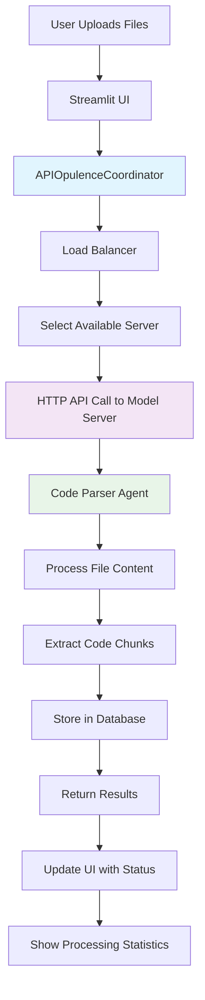
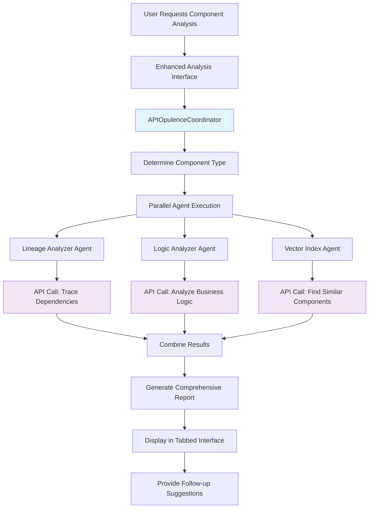
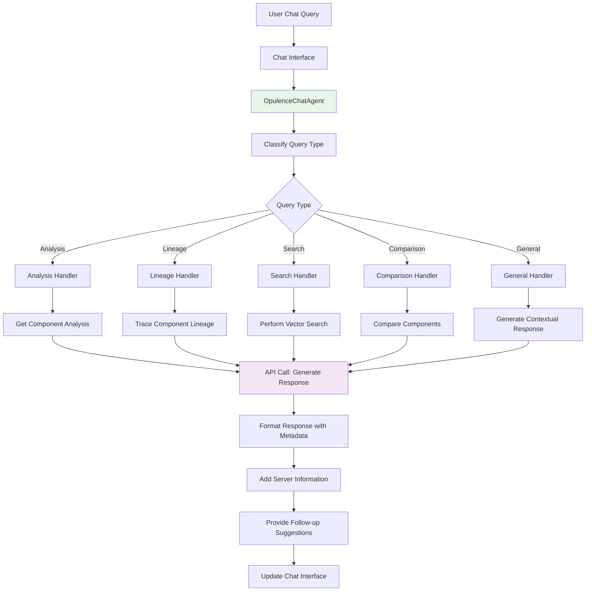

# Opulence API-Based System: UI/UX Components and Analysis Flow

## UI/UX Components Overview

### 1. Main Navigation & Layout
- **Header**: Main application title with API-based indicator
- **Sidebar Navigation**: 
  - Dashboard
  - File Upload
  - Enhanced Chat
  - Enhanced Analysis
  - System Health
- **Quick Actions Panel**: Refresh system, toggle modes
- **Status Indicators**: Server availability, system health

### 2. Dashboard Components

#### Core Metrics Panel
- **System Status**: Overall health indicator (🟢 Healthy / 🔴 Issues)
- **Server Availability**: Available/Total servers ratio
- **Active Agents**: Number of running agents
- **Database Status**: Connection and data availability
- **Processing Statistics**: Files processed, queries handled, API calls made

#### Server Management Grid
- **Server Cards**: Individual server status displays
  - Server name and endpoint
  - GPU ID assignment
  - Health status (🟢 🟡 🔴)
  - Active requests counter
  - Success rate percentage
  - Average latency metrics
  - Request history

#### Performance Visualization
- **Request Distribution Chart**: Bar chart showing requests per server
- **Latency Comparison**: Response time across servers
- **Success Rate Trends**: Historical performance data
- **Load Balancing Metrics**: Distribution effectiveness

#### System Controls
- **Refresh Statistics**: Real-time data updates
- **Clean Memory**: Resource management
- **Health Check**: Manual server validation
- **Export Logs**: System diagnostics download

### 3. File Upload Interface

#### Upload Options
- **Single File Upload**: Individual file selection
- **Batch Upload**: Multiple file processing
- **ZIP Archive**: Compressed file extraction and processing
- **File Type Detection**: Auto-detection of COBOL, JCL, CSV, etc.

#### Processing Display
- **Progress Indicators**: Real-time upload/processing status
- **Server Assignment**: Which API server is handling each file
- **Processing History**: Timeline of completed operations
- **Result Summary**: Success/failure statistics

### 4. Enhanced Chat Interface

#### Chat Components
- **Message History**: Conversation thread with role indicators
- **Server Information**: API processing details for each response
- **Response Types**: Analysis, lineage, comparison, search results
- **Follow-up Suggestions**: Contextual next actions
- **Quick Actions**: Export chat, generate summary, suggest questions

#### Chat Features
- **Typing Indicators**: "API-based Opulence is thinking..."
- **Response Metadata**: Server used, processing time, confidence
- **Interactive Suggestions**: Clickable follow-up questions
- **Context Preservation**: Conversation memory across sessions

### 5. Component Analysis Interface

#### Analysis Input
- **Component Selection**: Program, file, table, or field input
- **Type Detection**: Auto-detect or manual specification
- **Custom Questions**: Specific analysis queries
- **Batch Analysis**: Multiple component processing

#### Results Display
- **Analysis Overview**: Component type, status, processing time
- **Tabbed Results**: 
  - Overview: Key metrics and summary
  - Analyses: Detailed results from each agent
  - Report: Comprehensive analysis document
  - Debug: Raw data and processing information

### 6. System Health Interface

#### Server Configuration
- **Add/Edit Servers**: Dynamic server management
- **Endpoint Configuration**: URL, GPU ID, limits
- **Load Balancing**: Strategy selection and optimization
- **Health Monitoring**: Real-time server status

#### System Diagnostics
- **Database Statistics**: Record counts, performance metrics
- **Agent Status**: Active agents and their states
- **API Performance**: Response times, success rates
- **Error Tracking**: Failed requests and system issues

## Dashboard Elements Detail

### Main Dashboard Layout
```
┌─────────────────────────────────────────────────────────────┐
│ 🌐 Opulence API-Based Deep Research Agent                   │
├─────────────────────────────────────────────────────────────┤
│ Server Status: 🟢 2/3 Servers Available                     │
│                                                             │
│ ┌─────────────┐ ┌─────────────┐ ┌─────────────┐ ┌──────────┐│
│ │Files Proc'd │ │Total Queries│ │  API Calls  │ │Avg Time  ││
│ │    1,247    │ │    856      │ │   3,421     │ │ 2.3s     ││
│ └─────────────┘ └─────────────┘ └─────────────┘ └──────────┘│
│                                                             │
│ ┌─────────────────────────────────────────────────────────┐ │
│ │ Server Performance                                      │ │
│ │ [Request Distribution Chart] [Latency Comparison]      │ │
│ └─────────────────────────────────────────────────────────┘ │
│                                                             │
│ ┌─────────────────────────────────────────────────────────┐ │
│ │ Recent Activity                                         │ │
│ │ • 14:32 - Processed 5 files (via gpu_1, gpu_2)        │ │
│ │ • 14:28 - Analyzed CUSTOMER_PROC (via gpu_1)          │ │
│ │ • 14:25 - Traced ACCOUNT_ID lineage (via gpu_2)       │ │
│ └─────────────────────────────────────────────────────────┘ │
└─────────────────────────────────────────────────────────────┘
```

### Server Status Grid
```
┌─────────────┐ ┌─────────────┐ ┌─────────────┐
│   GPU_1     │ │   GPU_2     │ │   GPU_3     │
│🟢 Healthy   │ │🟢 Healthy   │ │🔴 Offline   │
│             │ │             │ │             │
│Active: 3    │ │Active: 1    │ │Active: 0    │
│Total: 145   │ │Total: 98    │ │Total: 0     │
│Success: 98% │ │Success: 99% │ │Success: N/A │
│Latency: 1.2s│ │Latency: 0.8s│ │Latency: N/A │
└─────────────┘ └─────────────┘ └─────────────┘
```

## Analysis Flow Overview

### 1. File Analysis Flow



### 2. Program Analysis Flow



### 3. Chat Agent Flow



## Detailed Component Workflows

### File Processing Workflow
1. **Upload**: User selects files through drag-drop or file picker
2. **Validation**: Check file types (COBOL, JCL, CSV, etc.)
3. **Server Selection**: Load balancer chooses optimal API server
4. **Processing**: Code Parser Agent analyzes file structure
5. **Chunking**: Break down code into logical sections
6. **Database Storage**: Store chunks with metadata
7. **Result Display**: Show processing statistics and server usage

### Component Analysis Workflow
1. **Input**: User specifies component name and type
2. **Detection**: System determines component type if not specified
3. **Multi-Agent Processing**: 
   - Lineage Analyzer: Traces data flow and dependencies
   - Logic Analyzer: Examines business rules and complexity
   - Vector Index: Finds similar components
4. **Result Aggregation**: Combine analysis from all agents
5. **Report Generation**: Create comprehensive analysis document
6. **Interactive Display**: Present results in tabbed interface

### Chat Interaction Workflow
1. **Query Processing**: Parse user intent and extract components
2. **Context Building**: Gather relevant analysis data
3. **Response Generation**: Use API calls to generate intelligent responses
4. **Metadata Addition**: Include server information and processing details
5. **Suggestion Generation**: Provide contextual follow-up questions
6. **History Management**: Maintain conversation context

## Key Features

### API-Based Architecture Benefits
- **Scalability**: Multiple model servers for load distribution
- **Reliability**: Automatic failover and circuit breakers
- **Flexibility**: Easy server addition/removal
- **Monitoring**: Real-time performance tracking

### User Experience Enhancements
- **Real-time Feedback**: Processing status and server information
- **Interactive Elements**: Clickable suggestions and follow-ups
- **Visual Indicators**: Server health and system status
- **Export Capabilities**: Reports, chat history, and logs

### Technical Capabilities
- **Multi-format Support**: COBOL, JCL, CSV, SQL files
- **Intelligent Analysis**: Business logic extraction and complexity assessment
- **Data Lineage**: End-to-end tracing of data flow
- **Semantic Search**: Natural language querying of codebase
- **Impact Analysis**: Change impact assessment and risk evaluation